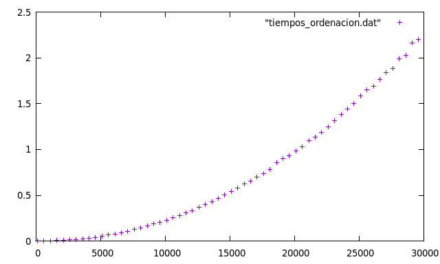
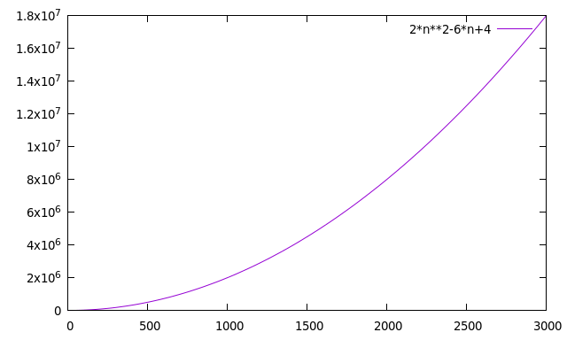
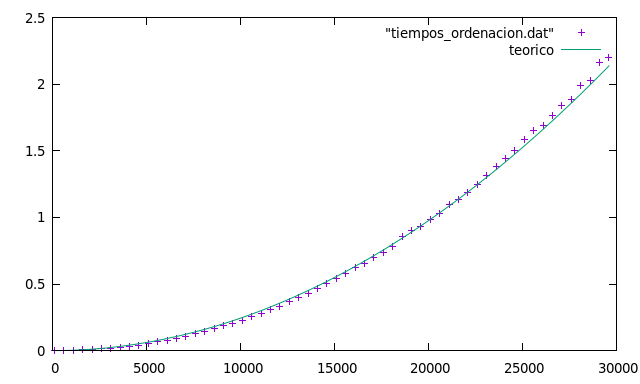
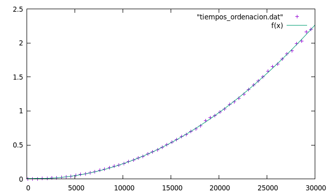
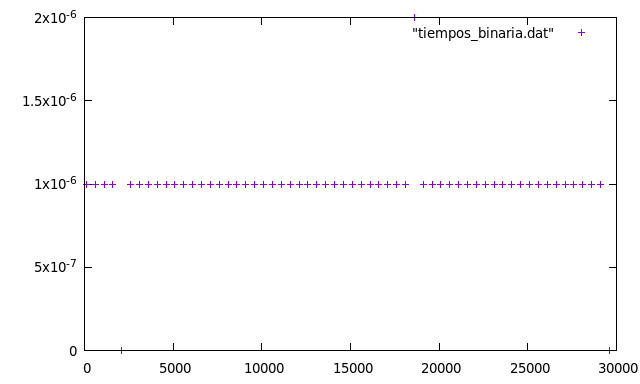
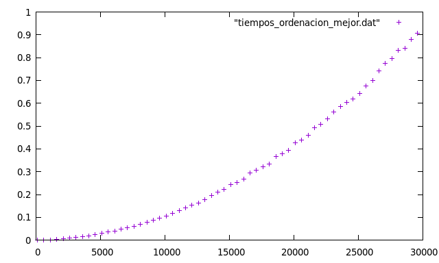
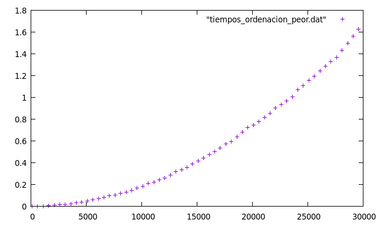
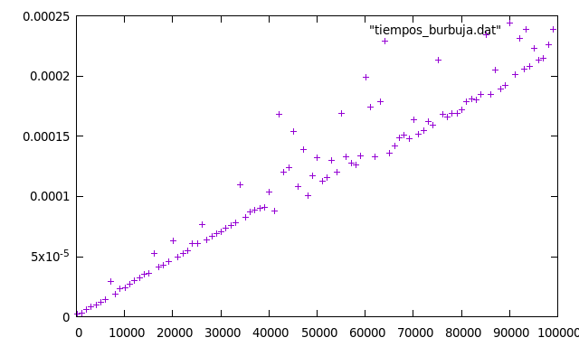
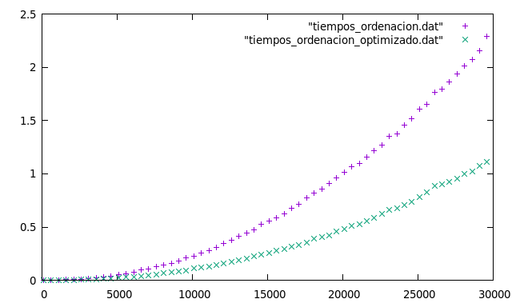
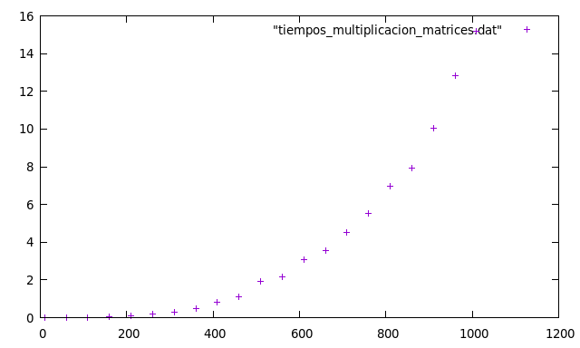

# Práctica 1. Eficiencia

> Alumno: Miguel Ángel Fernández Gutiérrez
>
> Sesión: 24 de septiembre, 2018

---

## Ejercicio 1: _Ordenación de la burbuja_

El siguiente código realiza la ordenación mediante el algoritmo de la burbuja:

~~~c++
void ordenar(int *v, int n) {
	for (int i=0; i<n-1; i++)
        for (int j=0; j<n-i-1; j++)
            if (v[j]>v[j+1]) {
				int aux = v[j];
				v[j] = v[j+1];
				v[j+1] = aux;
			}
}
~~~

Calcule la eficiencia teórica de este algoritmo. A continuación replique el experimento que
se ha hecho antes (búsqueda lineal) con este nuevo código. Debe:

* Crear un fichero `ordenacion.cpp` con el programa completo para realizar una
  ejecución del algoritmo.
* Crear un script `ejecuciones_ordenacion.csh` en C-Shell que permite ejecutar
  varias veces el programa anterior y generar un fichero con los datos obtenidos.
* Usar `gnuplot` para dibujar los datos obtenidos en el apartado previo.
  Los datos deben contener tiempos de ejecución para tamaños del vector 100, 600, 1100, …,
  30000.

Pruebe a dibujar superpuestas la función con la eficiencia teórica y la empírica. ¿Qué
sucede?

---

#### Solución al ejercicio 1

La eficiencia teórica de este algoritmo se calcula contando el número de operaciones de éste.
$$
T(n) = \sum_{i=1}^{n-1}\left(\sum_{j=1}^{n-i-1}\left(1+3\right)\right)=2(n^2-3n+2)\in O(n^2)
$$
A continuación, calcularemos la eficiencia de forma experimental. Para ello, creamos los siguientes _scripts_:

###### ordenacion.cpp

~~~c++
#include <iostream>
#include <ctime>    // Recursos para medir tiempos
#include <cstdlib>  // Para generación de números pseudoaleatorios

using namespace std;

void ordenar(int *v, int n) {
	for (int i=0; i<n-1; i++)
        for (int j=0; j<n-i-1; j++)
            if (v[j]>v[j+1]) {
				int aux = v[j];
				v[j] = v[j+1];
				v[j+1] = aux;
			}
}

void sintaxis() {
  cerr << "Sintaxis:" << endl;
  cerr << "  TAM: Tamaño del vector (>0)" << endl;
  cerr << "  VMAX: Valor máximo (>0)" << endl;
  cerr << "Se genera un vector de tamaño TAM con elementos aleatorios en [0,VMAX[" << endl;
  exit(EXIT_FAILURE);
}

int main(int argc, char * argv[])
{
  // Lectura de parámetros
  if (argc!=3)
    sintaxis();
  int tam=atoi(argv[1]);     // Tamaño del vector
  int vmax=atoi(argv[2]);    // Valor máximo
  if (tam<=0 || vmax<=0)
    sintaxis();
  
  // Generación del vector aleatorio
  int *v=new int[tam];       // Reserva de memoria
  srand(time(0));            // Inicialización del generador de números pseudoaleatorios
  for (int i=0; i<tam; i++)  // Recorrer vector
    v[i] = rand() % vmax;    // Generar aleatorio [0,vmax[
  
  clock_t tini;    // Anotamos el tiempo de inicio
  tini=clock();
  
  ordenar(v, tam); // Ordenamos el vector
  
  clock_t tfin;    // Anotamos el tiempo de finalización
  tfin=clock();

  // Mostramos resultados
  cout << tam << "\t" << (tfin-tini)/(double)CLOCKS_PER_SEC << endl;
  
  delete [] v;     // Liberamos memoria dinámica
}

~~~

###### ejecuciones_ordenacion.csh

~~~sh
#!/bin/csh
@ inicio = 100
@ fin = 30000
@ incremento = 500
set ejecutable = ordenacion
set salida = tiempos_ordenacion.dat

@ i = $inicio
echo > $salida
while ( $i <= $fin )
  echo Ejecución tam = $i
  echo `./{$ejecutable} $i 10000` >> $salida
  @ i += $incremento
end
~~~

Una vez ejecutado `ejeciciones_ordenacion.csh`, vemos que el plot de `gnuplot` para estos datos es:

El cual, claramente, coincide con la gráfica teórica:

Esto es más evidente si "mezclamos" ambas gráficas:

---

## Ejercicio 2: _Ajuste en la ordenación de la burbuja_

Replique el experimento de ajuste por regresión a los resultados obtenidos en el ejercicio
1 que calculaba la eficiencia del algoritmo de ordenación de la burbuja. Para ello
considere que la función es de la forma:
$$
f(x)=ax^2+bx+c
$$

---

#### Solución al ejercicio 2

Tomando de nuevo los datos del ejercicio anterior, y haciendo uso de `gnuplot`, obtenemos:

---

## Ejercicio 3: _Problemas de precisión_

Junto con este guión se le ha suministrado un fichero `ejercicio_desc.cpp`. En él se ha implementado un algoritmo. Se pide que:

* Explique qué hace este algoritmo.
* Calcule su eficiencia teórica.
* Calcule su eficiencia empírica.

Si visualiza la eficiencia empírica debería notar algo anormal. Explíquelo y proponga una solución. Compruebe que su solución es correcta. Una vez resuelto el problema realice la regresión para ajustar la curva teórica a la empírica.

---

#### Solución al ejercicio 3

El algoritmo es claramente el de búsqueda binaria, el cual encuentra un elemento en un vector ordenado.

La eficiencia teórica de este algoritmo es, evidentemente:
$$
T(n)\in O(\log n)
$$

Veamos si esto es cierto de forma empírica. Para ello, ejecutaremos el algoritmo con distintos tamaños y realizaremos un plot, obteniendo el siguiente resultado:

Esto ocurre porque en el algoritmo el vector debe estar ordenado, y el código genera un vector aleatorio.

---

## Ejercicio 4: _Mejor y peor caso_

Retome el ejercicio de ordenación mediante el algoritmo de la burbuja. Debe modificar el código que genera los datos de entrada para situarnos en dos escenarios diferentes:

* El mejor caso posible. Para este algoritmo, si la entrada es un vector que ya está ordenado el tiempo de cómputo es menor ya que no tiene que intercambiar ningún elemento.
* El peor caso posible. Si la entrada es un vector ordenado en orden inverso estaremos en la peor situación posible ya que en cada iteración del bucle interno hay que hacer un intercambio.

Calcule la eficiencia empírica en ambos escenarios y compárela con el resultado del ejercicio 1.

---

#### Solución al ejercicio 4

Retomando el algoritmo del ejercicio 1, calcularemos la eficiencia teórica en los casos mejor y peor.

En el mejor caso posible, es decir, si el vector ya estuviese ordenado, la eficiencia teórica sería:
$$
T(n) = \sum_{i=1}^{n-1}\left(\sum_{j=1}^{n-i-1}1\right)=\frac{1}{2}\left(n^2-3n+2\right)\in O(n^2)
$$
Si el vector estuviese completamente desordenado, la eficiencia teórica sería la calculada en el ejercicio 4 (pues hemos calculado para el peor caso posible):
$$
T(n) = \sum_{i=1}^{n-1}\left(\sum_{j=1}^{n-i-1}\left(1+3\right)\right)=2(n^2-3n+2)\in O(n^2)
$$
Reajustaremos el programa `ordenacion.cpp` del ejercicio 1 a dos nuevos programas: `ordenacion_mejor.cpp` y `ordenacion_peor.cpp`, que en lugar de un vector aleatorio ordenarán un vector ordenado y un vector ordenado a la inversa, respectivamente.

###### ordenacion_mejor.cpp

~~~c++
#include <iostream>
#include <ctime>    // Recursos para medir tiempos

using namespace std;

void ordenar(int *v, int n) {
	for (int i=0; i<n-1; i++)
        for (int j=0; j<n-i-1; j++)
            if (v[j]>v[j+1]) {
				int aux = v[j];
				v[j] = v[j+1];
				v[j+1] = aux;
			}
}

void sintaxis() {
  cerr << "Sintaxis:" << endl;
  cerr << "  TAM: Tamaño del vector (>0)" << endl;
  cerr << "  VMAX: Valor máximo (>0)" << endl;
  cerr << "Se genera un vector de tamaño TAM con elementos aleatorios en [0,VMAX[" << endl;
  exit(EXIT_FAILURE);
}

int main(int argc, char * argv[])
{
  // Lectura de parámetros
  if (argc!=3)
    sintaxis();
  int tam=atoi(argv[1]);     // Tamaño del vector
  int vmax=atoi(argv[2]);    // Valor máximo
  if (tam<=0 || vmax<=0)
    sintaxis();
  
  // Generación del vector aleatorio
  int *v=new int[tam];       // Reserva de memoria
  srand(time(0));            // Inicialización del generador de números pseudoaleatorios
  for (int i=0; i<tam; i++)  // Recorrer vector
    v[i] = i;                // Generar vector ordenado
  
  clock_t tini;    // Anotamos el tiempo de inicio
  tini=clock();
  
  ordenar(v, tam); // Ordenamos el vector
  
  clock_t tfin;    // Anotamos el tiempo de finalización
  tfin=clock();

  // Mostramos resultados
  cout << tam << "\t" << (tfin-tini)/(double)CLOCKS_PER_SEC << endl;
  
  delete [] v;     // Liberamos memoria dinámica
}
~~~

###### ordenacion_peor.cpp

~~~c++
#include <iostream>
#include <ctime>    // Recursos para medir tiempos

using namespace std;

void ordenar(int *v, int n) {
	for (int i=0; i<n-1; i++)
        for (int j=0; j<n-i-1; j++)
            if (v[j]>v[j+1]) {
				int aux = v[j];
				v[j] = v[j+1];
				v[j+1] = aux;
			}
}

void sintaxis() {
  cerr << "Sintaxis:" << endl;
  cerr << "  TAM: Tamaño del vector (>0)" << endl;
  cerr << "  VMAX: Valor máximo (>0)" << endl;
  cerr << "Se genera un vector de tamaño TAM con elementos aleatorios en [0,VMAX[" << endl;
  exit(EXIT_FAILURE);
}

int main(int argc, char * argv[])
{
  // Lectura de parámetros
  if (argc!=3)
    sintaxis();
  int tam=atoi(argv[1]);     // Tamaño del vector
  int vmax=atoi(argv[2]);    // Valor máximo
  if (tam<=0 || vmax<=0)
    sintaxis();
  
  // Generación del vector aleatorio
  int *v=new int[tam];       // Reserva de memoria
  srand(time(0));            // Inicialización del generador de números pseudoaleatorios
  for (int i=0; i<tam; i++)  // Recorrer vector
    v[i] = tam-i;            // Generar vector ordenado a la inversa
  
  clock_t tini;    // Anotamos el tiempo de inicio
  tini=clock();
  
  ordenar(v, tam); // Ordenamos el vector
  
  clock_t tfin;    // Anotamos el tiempo de finalización
  tfin=clock();

  // Mostramos resultados
  cout << tam << "\t" << (tfin-tini)/(double)CLOCKS_PER_SEC << endl;
  
  delete [] v;     // Liberamos memoria dinámica
}
~~~

Si realizamos el plot de la gráfica de ambos ejercicios obtenemos para el mejor caso posible:

Y para el peor caso posible:

Nótese que son similares, pues ambas son del mismo orden. Sin embargo, es evidente que uno es más rápido que el otro.

---

## Ejercicio 5: _Dependencia de la implementación_

Considere esta otra implementación del algoritmo de la burbuja:

~~~c++
void ordenar(int *v, int n) {
	bool cambio=true;
    for (int i=0; i<n-1 && cambio; i++) {
        cambio=false;
        for (int j=0; j<n-i-1; j++)
            if (v[j]>v[j+1]) {
				cambio=true;
				int aux = v[j];
				v[j] = v[j+1];
				v[j+1] = aux;
			}
	}
}
~~~

En ella se ha introducido una variable que permite saber si, en una de las iteraciones del bucle externo no se ha modificado el vector. Si esto ocurre significa que ya está ordenado y no hay que continuar.

Considere ahora la situación del mejor caso posible en la que el vector de entrada ya está ordenado. ¿Cuál sería la eficiencia teórica en ese mejor caso? Muestre la gráfica con la eficiencia empírica y compruebe si se ajusta a la previsión.

---

#### Solución al ejercicio 5

En este ejercicio contemplaremos el mejor caso posible, es decir, en el que el vector `v` está ordenado. La eficiencia teórica se calcularía del siguiente modo:
$$
T(n)=1+\left(\sum_{j=0}^{n-1}1\right)=n\in O(n)
$$

Pues, claramente, en este caso sólo recorrería el vector una vez.

Claramente vemos que la gráfica se asemeja en su mayoría a una lineal. Por tanto, en el mejor de los casos se cumple la complejidad especificada.

---

## Ejercicio 6: _Influencia del proceso de compilación_

Retome el ejercicio de ordenación mediante el algoritmo de la burbuja. Ahora replique dicho ejercicio pero previamente deberá compilar el programa indicándole al compilador que optimice el código. Esto se consigue así:

~~~
g++ -O3 ordenacion.cpp -o ordenacion_optimizado
~~~

Compare las curvas de eficiencia empírica para ver cómo mejora esto la eficiencia del programa.

---

#### Solución al ejercicio 6

Vemos que hay una clara diferencia entre ambos tiempos:

---

## Ejercicio 7: _Multiplicación matricial_

Implemente un programa que realice la multiplicación de dos matrices bidimensionales. Realice un análisis completo de la eficiencia tal y como ha hecho en ejercicios anteriores de este guion.

---

#### Solución al ejercicio 7

Primero crearemos el programa para multiplicar dos matrices bidimensionales. Trabajarmos con la clase `vector`.

###### multiplicacion_matrices.cpp

~~~c++
#include <iostream>
#include <ctime>    // Recursos para medir tiempos
#include <cstdlib>  // Para generación de números pseudoaleatorios
#include <vector>   // Lo haremos con vectores

using namespace std;

vector<vector<int> > producto(const vector<vector<int> > & a,
                              const vector<vector<int> > & b) {
    if ( a.size() > 0 && b.size() > 0 )
        if ( a[0].size() == b.size() ) {
            vector<vector<int> > resultado(a.size(), vector<int>(b[0].size(), 0));
            
            int elemento;
            for ( int i = 0; i < a.size(); i++ ) {
                for ( int j = 0; j < b.size(); j++ ) {
                    elemento = 0;
                    for ( int k = 0; k < b.size(); k++ )
                    	elemento += a[i][k]*b[k][j];
                    resultado[i][j] = elemento;
                }
            }
            
            return resultado;
        }
    
    vector<vector<int> > empty;
    return empty;
}

void show(const vector<vector<int> > & v) {
	for ( int i = 0; i < v.size(); i++ ) {
		for ( int j = 0; j < v[0].size(); j++ )
			cout << v[i][j] << ' ';
		cout << endl;
	}
	cout << endl;
}

void sintaxis() {
	cerr << "Sintaxis:" << endl;
	cerr << "  TAM: Tamaño del vector (>0)" << endl;
	cerr << "  VMAX: Valor máximo (>0)" << endl;
	cerr << "Se generan matrices cuadradas de tamaño TAM con elementos "
         << "aleatorios en [0,VMAX[" << endl;
    exit(EXIT_FAILURE);
}

int main(int argc, char * argv[]) {
    // Lectura de parámetros
    if (argc!=3)
    	sintaxis();
    int tam=atoi(argv[1]);     // Tamaño del vector
    int vmax=atoi(argv[2]);    // Valor máximo
    if (tam<=0 || vmax<=0)
    	sintaxis();
  
    // Generación del vector aleatorio v1
    vector<vector<int> > v1(tam, vector<int>(tam,0));   // Reserva de memoria
    srand(time(0));    // Inicialización del generador de números pseudoaleatorios
    for (int i=0; i<tam; i++)          // Recorrer vector
		for (int j=0; j<tam; j++)
			v1[i][j] = rand() % vmax;  // Generar aleatorio [0,vmax[

    // Generación del vector aleatorio v2
    vector<vector<int> > v2(tam, vector<int>(tam,0));   // Reserva de memoria
    for (int i=0; i<tam; i++)          // Recorrer vector
		for (int j=0; j<tam; j++)
			v2[i][j] = rand() % vmax;  // Generar aleatorio [0,vmax[
  
    clock_t tini;    // Anotamos el tiempo de inicio
    tini=clock();
  
    vector<vector<int> > resultado;
    resultado = producto(v1, v2);     // Multiplicamos las matrices
  
    clock_t tfin;    // Anotamos el tiempo de finalización
    tfin=clock();

    // Mostramos resultados
    cout << tam << "\t" << (tfin-tini)/(double)CLOCKS_PER_SEC << endl;
}
~~~

###### ejecuciones_multiplicacion_matrices.csh

~~~sh
#!/bin/csh
@ inicio = 10
@ fin = 1010
@ incremento = 50
set ejecutable = multiplicacion_matrices
set salida = tiempos_multiplicacion_matrices.dat

@ i = $inicio
echo > $salida
while ( $i <= $fin )
  echo Ejecución tam = $i
  echo `./{$ejecutable} $i 10000` >> $salida
  @ i += $incremento
end
~~~

El resultado de hacer el plot del archivo `tiempos_multiplicacion_matrices.dat` es el siguiente:

Veamos si se ajusta al análisis teórico del algoritmo. Para ello, calcularemos su complejidad de la siguiente forma:
$$
T(n_A, n_B)=1+1+1+1+\sum_{i=0}^{n_A}\left(\sum_{j=0}^{n_B}\left(1+\sum_{k=0}^{n_B}1+1\right)\right)+1=n_A(n_B(n_B+2))+5=n_An_B^2+2n_An_B+5
$$
En el que `n_A` es el número de filas de la matriz `A`, y análogamente para la matriz `B`.

Nótese que en nuestras ejecuciones trabajamos con el caso particular en el que el número de filas y el número de columnas es el mismo (_matriz cuadrada_), es decir, en el que:
$$
n_A=n_B=n
$$
Aplicando esto, obtenemos que:
$$
T(n)=n^3+2n^2+5\in O(n^3)
$$

Pudiendo interpolarla con una función cúbica.

---

