# Árboles

## Conceptos sobre árboles

###### Árbol $n$-ario

* **Base:** un nodo es un árbol $n$-ario (si un árbol tiene un sólo nodo, éste es el **nodo raíz**).
* **Recurrencia:** si _n_ es un nodo y $T_1$, ..., $T_k$ son árboles $n$-arios con raíces $n_1$, ..., $n_k$ respectivamente, entonces podemos construir un árbol que tenga como raíz el nodo $n$ y como subárboles $T_1$, ..., $T_k$.

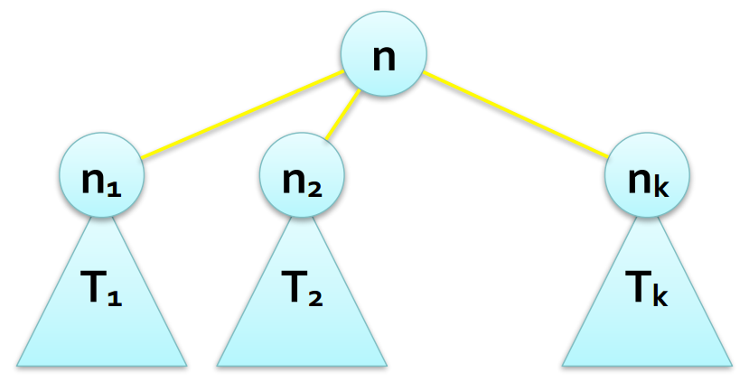

###### Árbol etiquetado

Si todos los nodos contienen una etiqueta.

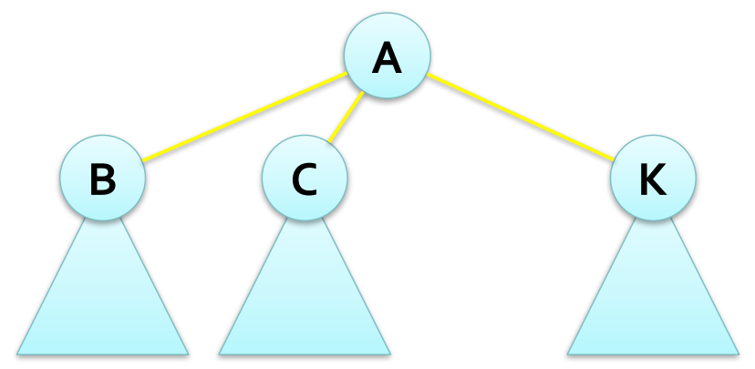

###### Nodos hermanos

Son los nodos que son hijos de un mismo **padre**.

###### Grado de un nodo

Es el número de subárboles que tiene dicho nodo.

* **Hojas o nodos terminales:** grado 0.
* **Nodos no terminales o interiores:** grado no 0.

###### Grado de un árbol

Es el máximo de los grados de los nodos del árbol.

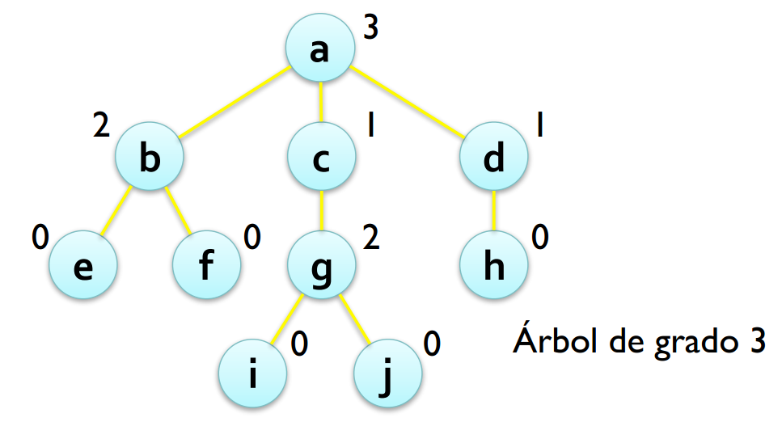

###### Camino entre dos nodos

El camino entre dos nodos se define como la secuencia de nodos del árbol necesaria para llegar de un nodo al otro.

###### Longitud de un camino

La longitud del camino entre dos nodos es igual al nº de nodos que forman este camino menos 1 (nº de ejes que hay en el camino).

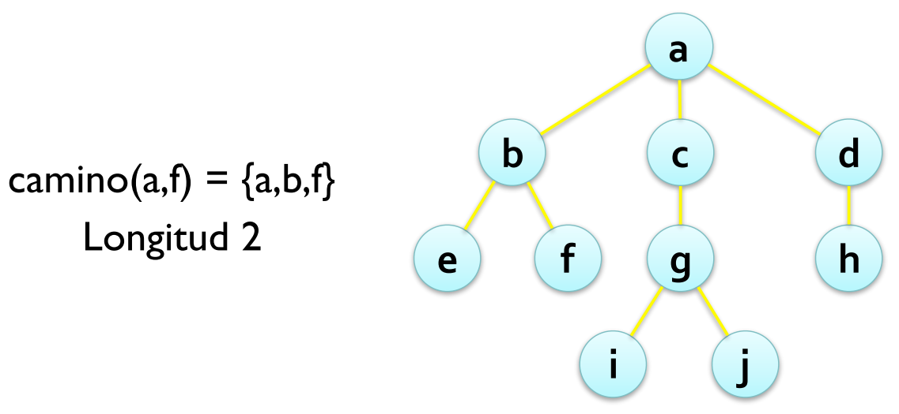

###### Nivel de un nodo

* **Base:** el nivel del nodo raíz es 0.
* **Recurrencia:** si un nodo está en el nivel $i$, todos sus hijos están en el nivel $i+1$.

###### Altura y profundidad

La **profundidad** de un árbol es el máximo de los niveles de los nodos de éste.

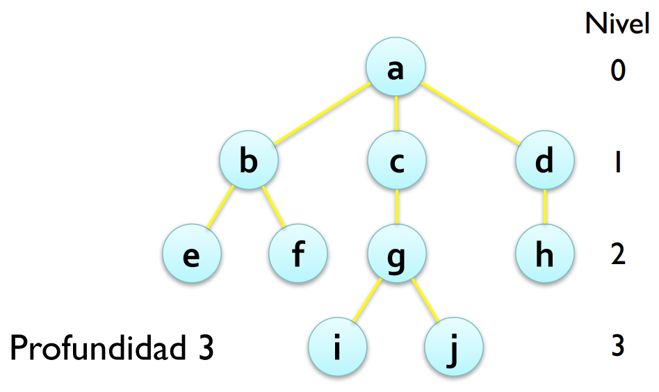

### Árboles binarios

* **Base:** un árbol vacío es un árbol binario.
* **Recurrencia:** si $n$ es un nodo y $T_{izq}$ y $T_{der}$ son árboles binarios, entonces podemos construir un nuevo árbol binario que tenga como raíz el nodo $n$ y como subárboles $T_{izq}$ y $T_{der}$ (**subárbol izquierdo** y **subárbol derecho** de $n$, respectivamente).

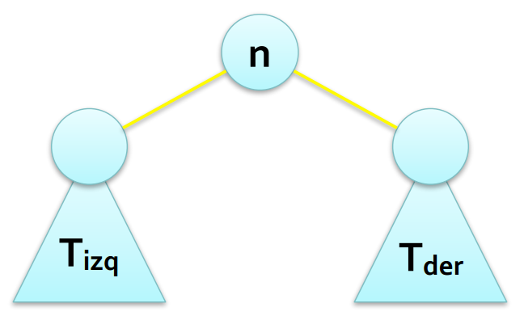

> Un árbol binario NO es un árbol $n$-ario de orden 2.

###### Árbol binario homogéneo

Aquel cuyos nodos tienen grado 0 ó 2 (no hay ninguno de grado 1).

###### Árbol binario completo

Aquel que tiene todos los niveles llenos excepto quizás el último, en cuyo caso los huecos deben quedar **a la derecha**.

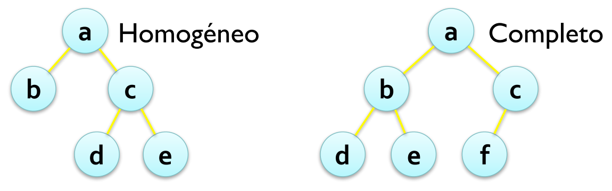

> En un árbol binario completo con $n$ nodos, el camino más largo desde la raíz a las hojas no atraviesa más de $\log n$ nodos.

#### Número máximo de nodos por nivel

En un árbol binario el número máximo de nodos que puede haber en el nivel $i$ es de $2^i$.

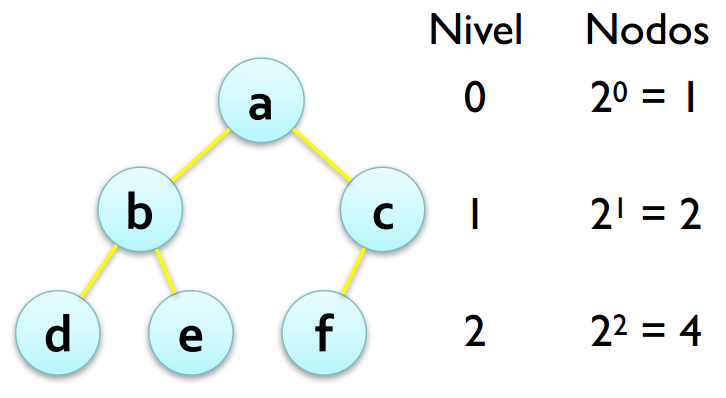

> En un árbol binario completo con altura $k$ el número máximo de nodos es de $2^k-1$ nodos.

### Esquemas de recorrido

#### Recorrido en árboles $n$-arios

##### Recorridos en profundidad

* **Preorden:** raíz, Pre($T_1$), Pre($T_2$), ..., Pre($T_k$).
* **Inorden:** In($T_1$), raíz, In($T_2$), ..., In($T_k$).
* **Postorden:** Post($T_1$), Post($T_2$), ..., Post($T_k$), raíz.

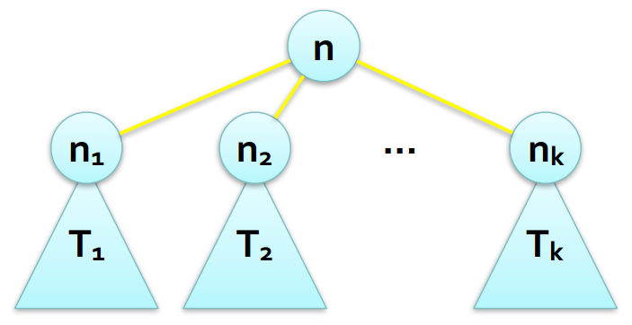

##### Recorrido en anchura

Por niveles: de arriba a abajo, y de izquierda a derecha, comenzando por la raíz.

###### :bookmark_tabs: _Ejemplo_

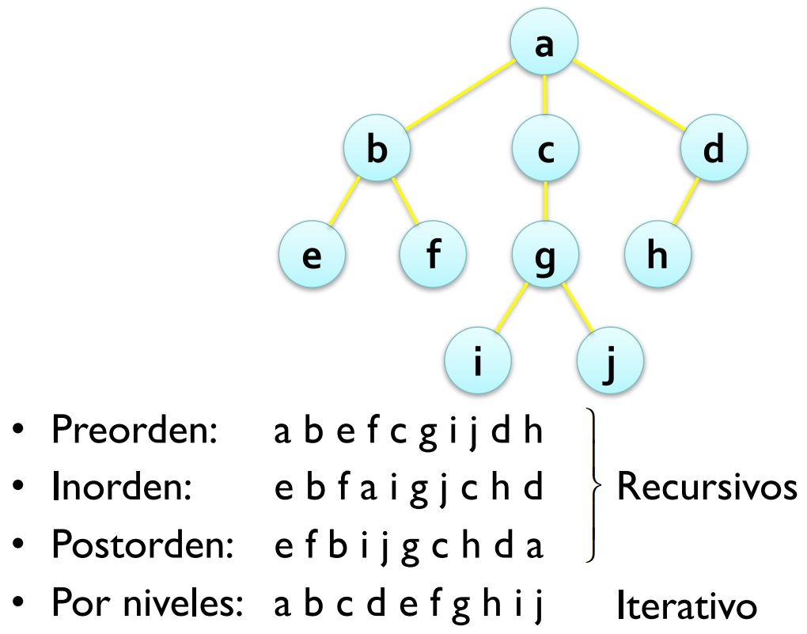

#### Recorridos en árboles binarios

##### Recorridos en profundidad

- **Preorden:** raíz, Pre($T_{izq}$), Pre($T_{der}$).
- **Inorden:** In($T_{izq}$), raíz, In($T_{der}$).
- **Postorden:** Post($T_{izq}$), Post($T_{der}$), raíz.

Se pueden realizar de forma recursiva, aplicando el esquema de construcción de funciones recursivas para árboles binarios.

##### Recorrido en anchura

Por niveles, de izquierda a derecha. De forma iterativa.

###### :bookmark_tabs: _Ejemplo_

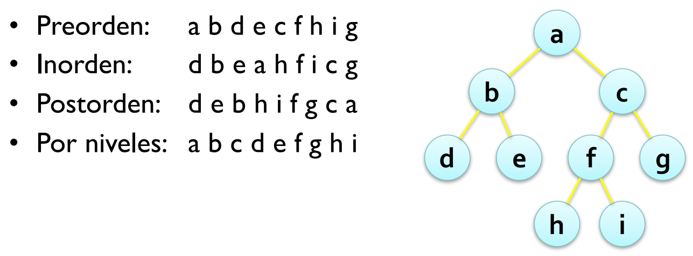

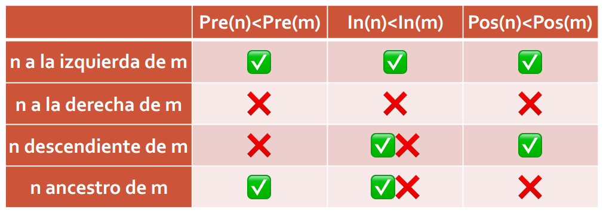

#### Reconstrucción de árboles

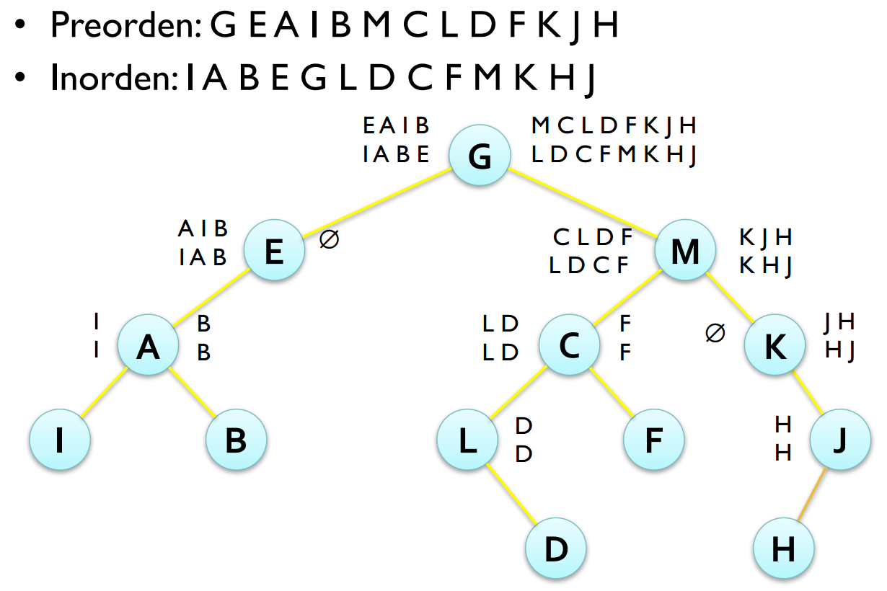

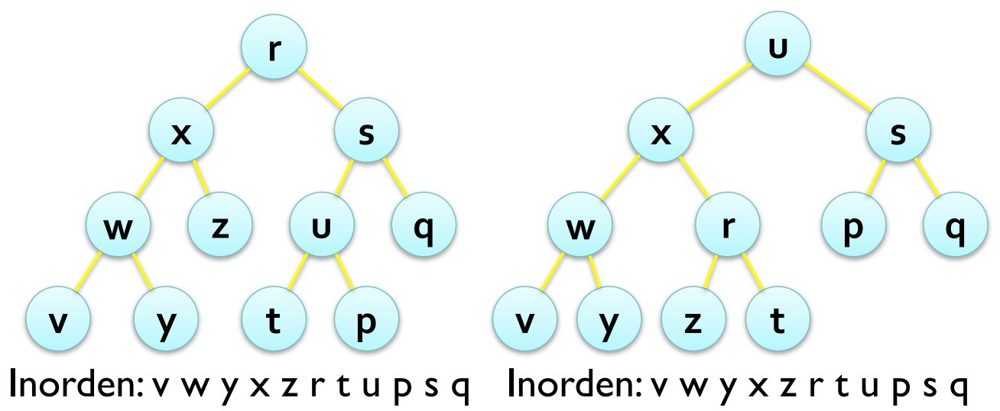

> En general, un árbol no puede recuperarse con sólo uno de sus recorridos.

#### Lectura/escritura de un árbol

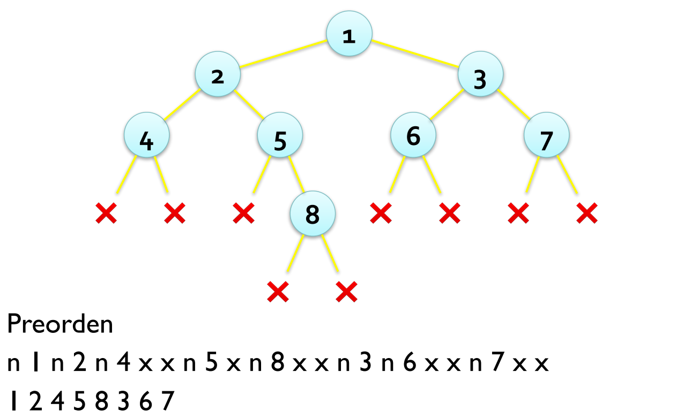

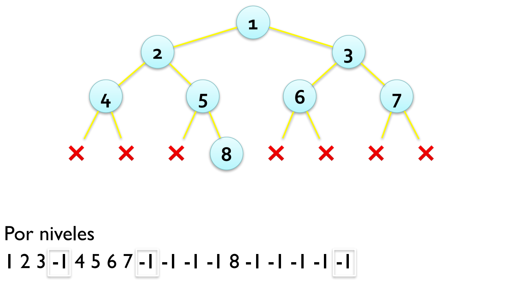

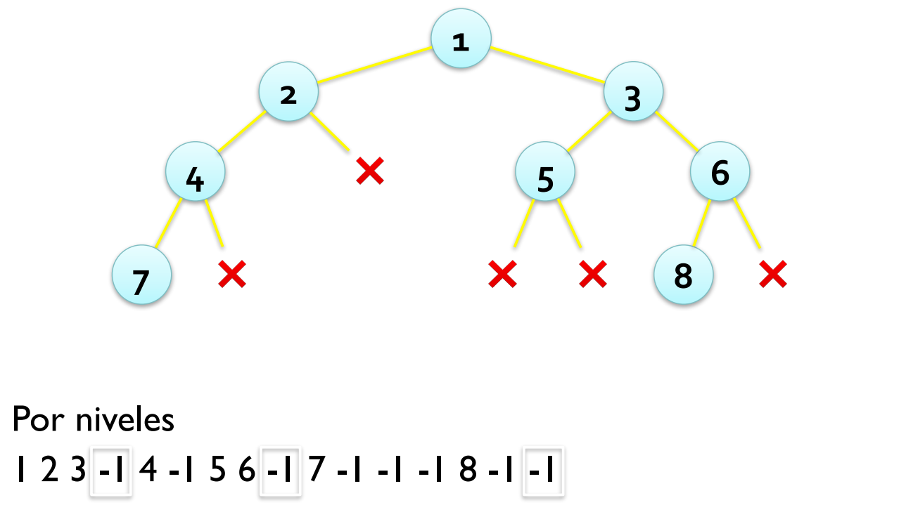

### Aplicación: árboles de expresión

* **Árboles sintácticos:** árboles que contienen las derivaciones de una gramática necesarias para obtener una frase del lenguaje.
* **Árboles de expresión:** etiquetamos
  * hojas con un operando.
  * nodos interiores con un operador.

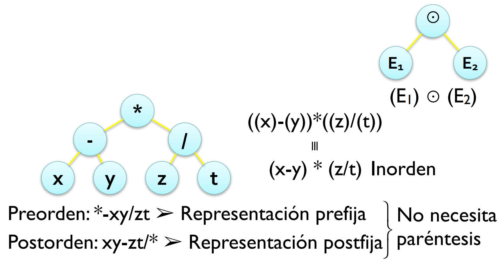

#### Resolución de ambigüedades

Recorridos en preorden o postorden, más

* nivel de cada nodo, ó
* número de hijos de cada nodo.

###### :bookmark_tabs: _Ejemplo_

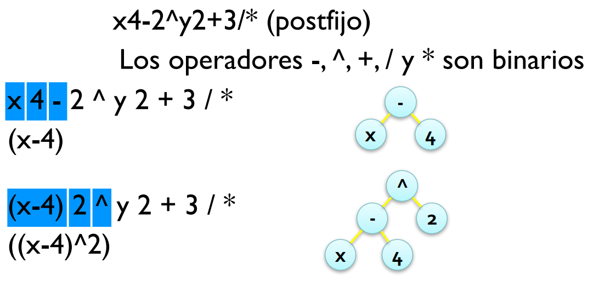

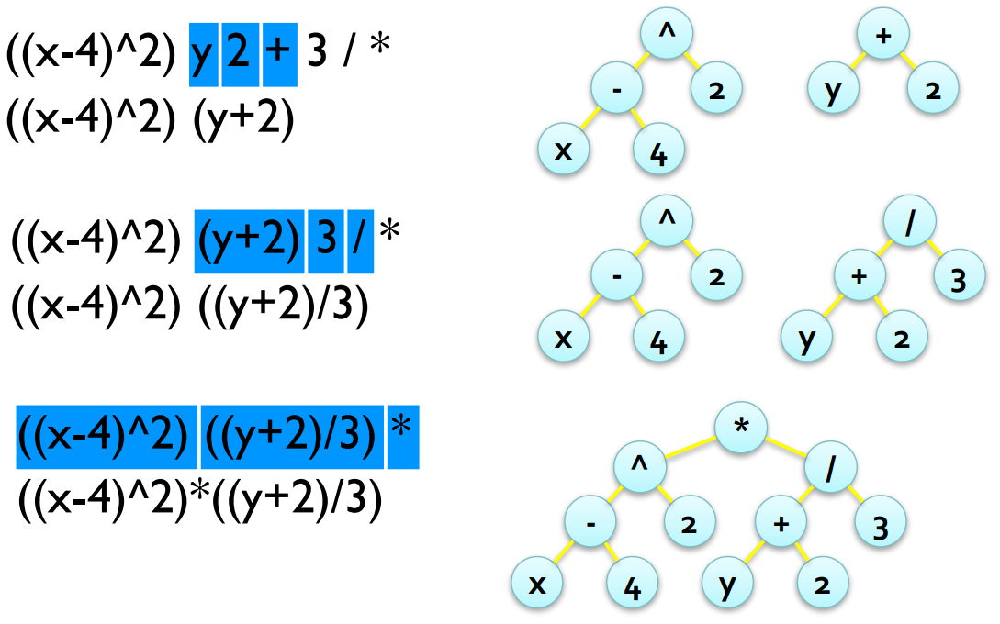

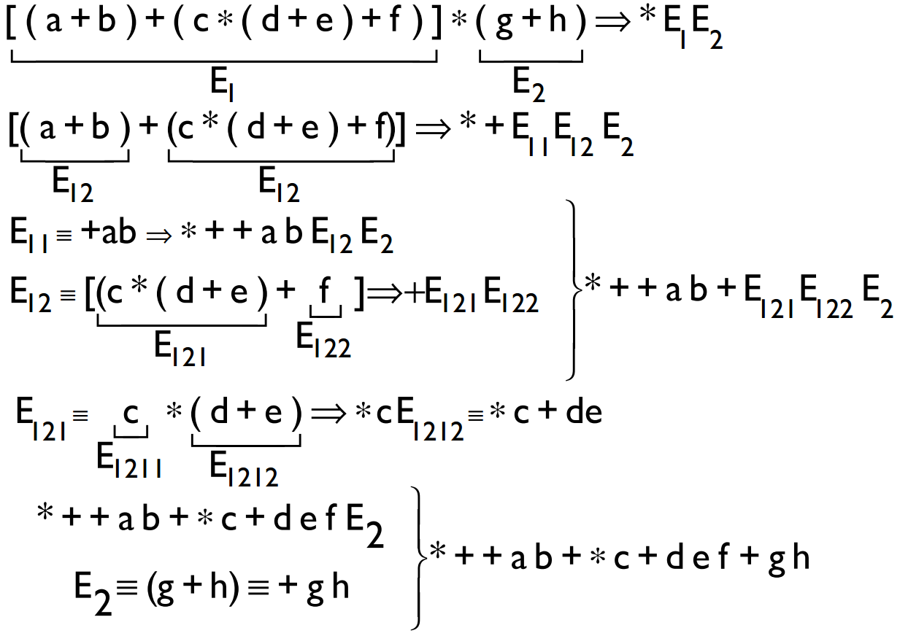

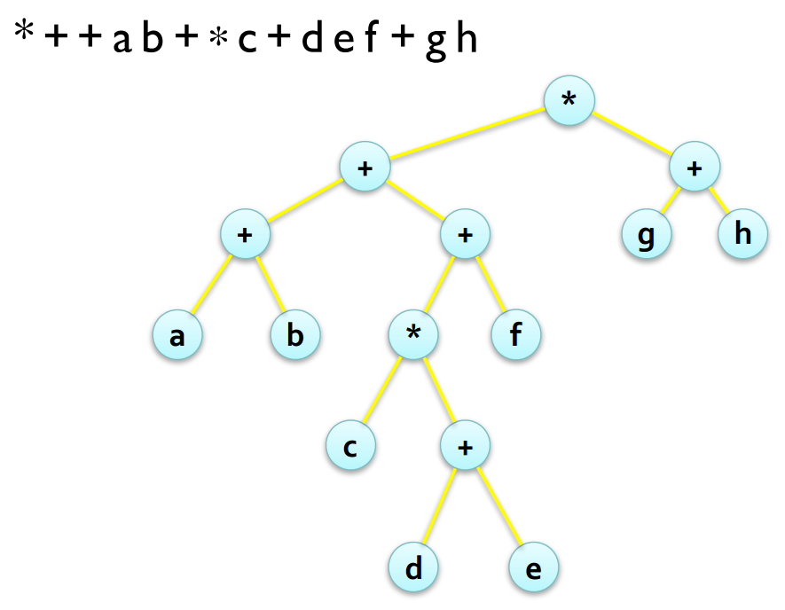

## Árboles binarios. Funciones y representación

### Definición de funciones en árboles

En general, la forma más simple de definir una función sobre un árbol ($n$-ario o binario) es **trasladar la definición recurrente (o recursiva) del dominio a la definición de ésta**.

Esto no quiere decir que toda función definida sobre un árbol deba ser recursiva. Podemos encontrar problemas cuya solución exija diseñar funciones iterativas, ya que no es posible encontrar una función recursiva (por extensión de la definición recurrente del dominio) que lo resuelva. _Ej: el recorrido por niveles del árbol._

###### Función $f(t)$ sobre un árbol binario $t$

Definición por extensión de la definición recurrente del conjunto de árboles binarios.

* **Base:** el valor de la función si $t$ es el árbol vacío.
* **Recurrencia:** se **supone conocida** (**hipótesis**) la función para cada uno de los subárboles binarios, $T_{izq}$ y $T_{der}$ de $t$. Se **calcula** el valor final de la función supuestos conocidos los valores anteriores.

###### :bookmark_tabs: _Ejemplo:_ igualdad de árboles binarios

* **Base:** si $t_1$ y $t_2$ son árboles binarios vacíos, entonces son iguales.

* **Recurrencia:**

  * **Hipótesis:**

    * $\text{igual}(tizq_1, tizq_2)$
    * $\text{igual}(tder_1, tder_2)$

    donde $tizq_i$ es el subárbol izquierdo de $t_i$, y $tder_i$ es el derecho.

  * **Tesis:** los árboles binarios $t_1$ y $t_2$ serán iguales si se cumplen las condiciones:

    * $t_1.\text{label}() = t_2.\text{label}()$
    * $\text{igual}(tizq_1, tizq_2)$ e $\text{igual}(tder_1, tder_2)$

###### :bookmark_tabs: _Ejemplo:_ altura de árboles binarios

- **Base:** si $t$ es un árbol binario vacío, entonces su altura es 0.

- **Recurrencia:**

  - **Hipótesis:**

    - $\text{altura}(tizq) = a_{izq}$
    - $\text{altura}(tder) = a_{der}$

    donde $tizq$ es el subárbol izquierdo de $t$, y $tder$ es el derecho. Ambas alturas se suponen conocidas.

  - **Tesis:** calculamos la altura como:

    - $1 + \text{máx}(a_{izq}, a_{der})$

###### :bookmark_tabs: _Ejemplo:_ árboles binarios isomorfos

- **Base:** si $t_1$ y $t_2$ son árboles binarios vacíos, entonces son isomorfos.

- **Recurrencia:**

  - **Hipótesis:**

    - $\text{iso}(tizq_1, tizq_2)$
    - $\text{iso}(tder_1, tder_2)$
    - $\text{iso}(tizq_1, tder_2)$
    - $\text{iso}(tder_1, tizq_2)$

    donde $tizq_i$ es el subárbol izquierdo de $t_i$, y $tder_i$ es el derecho.

  - **Tesis:** los árboles binarios $t_1$ y $t_2$ serán isomorfos si se cumplen las condiciones:

    - $t_1.\text{label}() = t_2.\text{label}()$
    - `(` $\text{iso}(tizq_1, tizq_2)$ `&&` $\text{iso}(tder_1, tder_2)$ `)` `||` `(` $\text{iso}(tizq_1, tder_2)$ `&&` $\text{iso}(tder_1, tizq_2)$ `)`

### Representación mediante vectores

Las etiquetas de los nodos se almacenan en un vector. Los nodos se numeran de la forma siguiente:

* A la raíz le corresponde el índice 0.
* Si a un nodo le corresponde el índice $k$:
  * Su hijo izquierdo, si tiene, está en la posición $2*(k+1)-1 \rightarrow 2*k+1$.
  * Su hijo derecho, si tiene, está en la posición $2*(k+1) \rightarrow 2*k+2$.
  * Su padre, si tiene, está en la posición $(k-1)/2$.

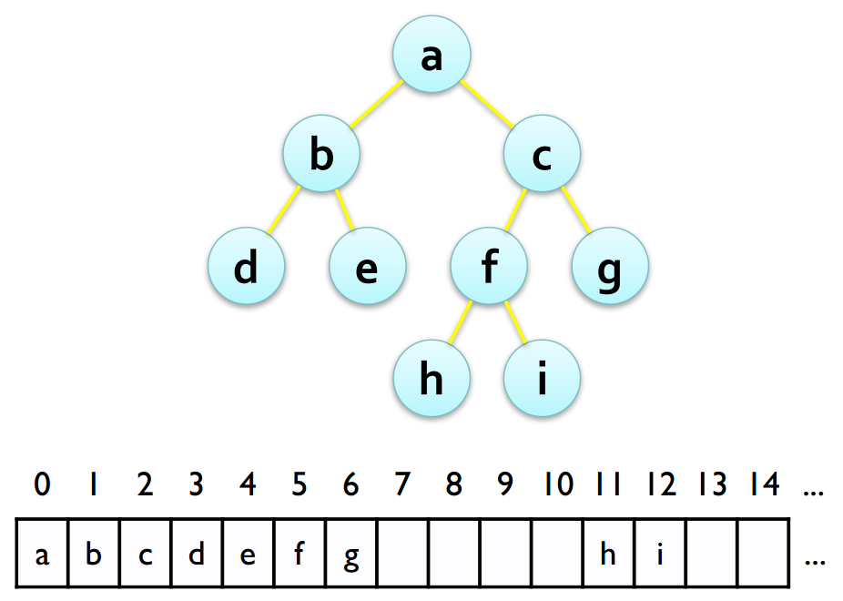

### Representación mediante celdas enlazadas

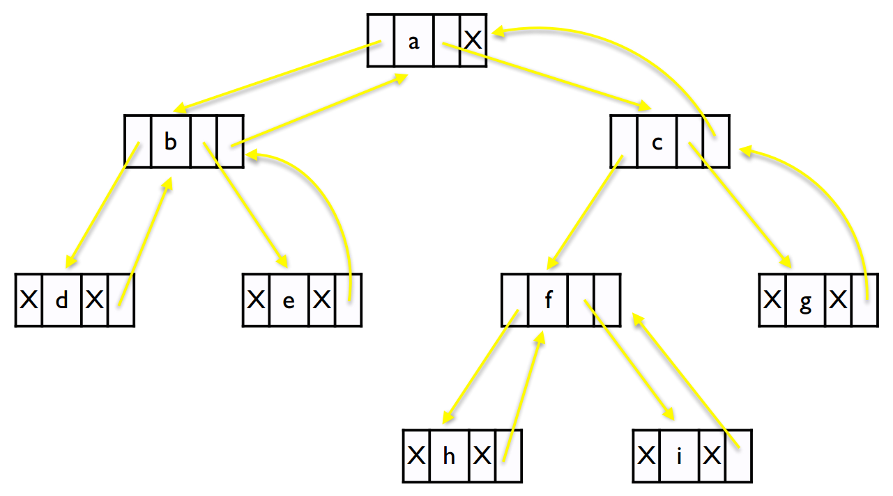

### `{;}` TDA árbol binario

#### Definición

Un árbol binario es un árbol que, o es vacío, o en cada nodo puede tener a lo más dos hijos, denominados _hijo a la izquierda_ e _hijo a la derecha_, pudiendo un nodo tener un hijo a la derecha y no tener un hijo a la izquierda, o viceversa.

#### Implementación

###### :file_folder: `ArbolBinario.h`

~~~c++
/**
 * @memo TDA ArbolBinario
 *
 * @doc @b Definición: Una instancia @a a del tipo de dato
 * abstracto @a ArbolBinario sobre un dominio @a Tbase puede
 * construirse como
 *   - un objeto vacío (árbol vacío) si no contiene ningún
 *     elemento. Lo denotamos {}
 *   - un árbol que contiene un elemento destacado, el nodo
 *     raíz, con un valor @a e en el dominio @a Tbase
 *     (denominado @a etiqueta) y dos subárboles (@a T_i
 *     izquierdo y @a T_d derecho) del TDA @a ArbolBinario
 *     sobre @a Tbase. Se establece una relación @a padre-hijo
 *     entre cada nodo y los nodos raíz de los subárboles (si
 *     los hubiera) que cuelgan de él. Lo denotaremos:
 *         {e, {T_i}, {T_d}}
 *
 * Para poder usar el tipo de dato @a ArbolBinario se debe
 * incluir el fichero @a ArbolBinario.h
 *
 * El espacio requerido para el almacenamiento es @a O(n),
 * donde @a n es el número de nodos del árbol.
 *
 * @author
 * @version 1.0
 */
template <class Tbase>
class ArbolBinario{
/**
 * @name Implementación de TDA ArbolBinario
 * @memo Parte privada
 */
private:
	/**
	 * @memo Nodo
	 * @doc En cada estructura @a nodo se almacena una etiqueta
     * de árbol, que se implementa como un conjunto de nodos
     * enlazados según la relación padre-hijo.
     */
    struct nodo {
     	/**
     	 * @memo Elemento almacenado
     	 * @doc En este campo se almacena la etiqueta que
     	 * corresponde a este nodo.
     	 */
     	Tbase etiqueta;
     	/**
     	 * @memo Puntero al hijo izquierdo
     	 * @doc En este campo se almacena un puntero al nodo
     	 * raíz del subárbol izquierdo, o el valor 0 en caso
     	 * de que no tenga.
     	 */
     	struct nodo *izqda;
     	/**
     	 * @memo Puntero al hijo derecho
     	 * @doc En este campo se almacena un puntero al nodo
     	 * raíz del subárbol derecho, o el valor 0 en caso
     	 * de que no tenga.
     	 */
     	struct nodo *drcha;
     	/**
     	 * @memo Puntero al padre
     	 * @doc En este campo se almacena un puntero al nodo
     	 * padre, o el valor 0 si es la raíz.
     	 */
     	struct nodo *padre;
     }
     
     /**
      * @memo Puntero a la raíz.
      * @doc Este miembro es un puntero al primer nodo, que
      * corresponde a la raíz del árbol. Vale 0 si el árbol
      * es un árbol vacío.
      */
     struct nodo *laraiz;
     	
     /**
      * @name @b Invariante de la representación
      * @memo Inv. de ArbolBinario
      * @doc
      * Sea @a T, un árbol binario sobre el tipo @a Tbase,
      * entonces el invariante de la representación es:
      *
      * Si @a T es vacío, entonces T.laraiz=0, y si no:
      * T.laraiz->padre = 0 Y
      * para todo @a n nodo de @a T, n->izqda != n->drcha Y
      * para todos @a n, @m nodos de @a T, si
      *   n->izqda == m || n->drcha == m, entonces
      *   m->padre == n.
      */
     	
     /**
      * @name @b Función de abstracción
      * @memo F.A. de ArbolBinario
      * @doc
      * Sea @a T un árbol binario sobre el tipo @a Tbase,
      * entonces si lo denotamos tambien Arbol(T.laraiz),
      * es decir, como el árbol que cuelga de su raíz,
      * entonces este árbol del conjunto de valores en la
      * representación se aplica al árbol
      *
      * { T.laraiz->etiqueta, {Arbol(T.laraiz->izqda)},
      * {Arbol(T.laraiz->drcha)} }.
      *
      * donde {0} es el árbol vacío.
      */

	/**
	 * @memo Destruye el subárbol
	 * @param n: nodo que destruir junto con sus descendientes
	 * @doc Libera los recursos que ocupa @a n y sus descendientes
	 */
	void destruir (nodo *n);
	
	/**
	 * @memo Copia un subárbol
	 * @param dest: referencia al puntero del que cuelga la copia
	 * @param orig: puntero a la raíz del subárbol a copiar
	 * @doc Hace una copia de todo el subárbol que cuelga de
	 * @a orig en el puntero @a dest. Es importante ver que en
	 * dest->padre (si existe) no se asigna ningún valor, pues no
	 * se conoce.
	 */
	void copiar(nodo *&dest, nodo *orig);
	
	/**
	 * @memo Cuenta el número de nodos
	 * @param n: nodo del que cuelga el subárbol a contabilizar
	 * @doc Copia cuántos nodos cuelgan de @n, incluido éste
	 */
	int contar(nodo *n);
	
	/**
	 * @memo Comprueba igualdad de subárbol
	 * @param n1: primer subárbol a comparar
	 * @param n2: segundo subárbol a comparar
	 * @doc Comprueba si son iguales los subárboles que cuelgan de
	 * @a n1 y @a n2. Para ello deberán tener los mismos nodos en
	 * las mismas posiciones y con las mismas etiquetas.
	 */
	bool soniguales(nodo *n1, nodo *n2);
	
	/**
	 * @memo Escribe un subárbol
	 * @param out: stream de salida donde escribir
	 * @param nod: nodo del que cuelga el subárbol a escribir
	 * @doc Escribe en la salida todos los nodos del subárbol que
	 * cuelga del nodo @a nod siguiendo un recorrido en preorden.
	 * La forma de impresión de cada nodo es:
	 *   - si el nodo es @a nodo_nulo, imprime el carácter 'x'.
	 *   - si el nodo no es @a nodo_nulo, imprime el carácter 'n'
	 *     seguido de un espacio, al que sigue la etiqueta.
	 */
	void escribe_arbol(std::ostream &out, nodo *nod) const;
	
	/**
	 * @memo Lee un subárbol
	 * @param in: stream de entrada desde el que leer
	 * @param nod: referencia al nodo que contendrá el subárbol
	 * leído
	 * @doc Lee de la entrada @a in los elementos de un árbol
	 * según el formato que se presenta en la función de
	 * escritura. @see escribe_arbol
	 */
	void lee_arbol(std::istream &in, nodo *&nod);

/**
 * @name Implementación de TDA ArbolBinario
 * @memo Parte pública
 */
public:
	/**
	 * @memo Tipo Nodo
	 * @doc Ete tipo nos permite manejar cada uno de los nodos del
	 * árbol. Los valores que tomará serán tantos como nodos en el
	 * árbol (para poder referirse a cada uno de ellos) y además un
	 * varlor destacado @a nodo_nulo, que inidica que no se refiere
	 * a ninguno de ellos.
	 *
	 * Una variable @a n de este tipo se declara
	 *     ArbolBinario::Nodo n;
	 * Las operaciones válidas sobre el tipo @a nodo son:
	 *   - operador de asignación (=)
	 *   - operador de comprobación de igualdad (==)
	 *   - operador de comprobación de no igualdad (!=)
	 */
	typedef struct nodo *Nodo;
	
	/**
	 * @memo Nodo nulo
	 * @doc El valor de nodo nulo se podrá indicar como:
	 */
	static const Nodo nodo_nulo = 0;
	
	/**
	 * @name @b Operaciones del TDA ArbolBinario
	 * @memo @b Operaciones sobre ArbolBinario
	 */
	 
	/**
	 * @memo Constructor por defecto
	 * @doc Reserva los recursos e inicializa el árbol a vacío {}.
	 * La operación se realiza en tiempo O(1).
	 */
	ArbolBinario();
	
	/**
	 * @memo Constructor de raíz
	 * @doc Reserva todos los recursos e inicializa el árbol con un
	 * único nodo raíz que tiene la etiqueta @a e, es decir, el árbol
	 * {e, {}, {}}. La operación se realiza en tiempo O(1).
	 */
	ArbolBinario(const Tbase &e);
	
	/**
	 * @memo Constructor de copia
	 * @param v: ArbolBinario a copiar
	 * @doc Construye el árbol duplicando el contenido de @a v en el
	 * árbol receptor. La operación se realiza en tiempo O(n), donde
	 * @a n es el número de elementos de @a v.
	 */
	ArbolBinario(const ArbolBinario<Tbase> &v);
	
	/**
	 * @memo Destructor
	 * @doc Libera los recursos ocupados por el árbol receptor. La
	 * operación se realiza en tiempo O(n), donde @a n es el número de
	 * elementos del árbol receptor.
	 */
	~ArbolBinario();
	
	/**
	 * @memo Asignación
	 * @param v: ArbolBinario a copiar
	 * @return Referencia al árbol receptor
	 * @doc Asigna el valor del árbol duplicando el contenido de @a v en
	 * el árbol receptor. La operación se realiza en tiempo O(n), donde
	 * @a n es el número de elementos de @a v.
	 */
	ArbolBinario<Tbase>& operator=(const ArbolBinario<Tbase> &v);
	
	/**
	 * @memo Asignar nodo raíz
	 * @param e: etiqueta a asignar al nodo raíz
	 * @doc Vacía el árbol receptor y le asigna como valor el árbol de
	 * un único nodo cuya etiqueta es @a e.
	 */
	void asignaRaiz(const Tbase &e);
	
	/**
	 * @memo Raíz del árbol
	 * @return Nodo raíz del árbol receptor
	 * @doc Devuelve el nodo raíz, que coincide con @a nodo_nulo si el
	 * árbol está vacío. La operación se realiza en tiempo O(1).
	 */
	Nodo raiz() const;
	
	/**
	 * @memo Hijo izquierda
	 * @param n: nodo del que se quiere obtener el hijo a la izquierda.
	 * @a n no es @a nodo_nulo
	 * @return Nodo hijo a la izquierda
	 * @doc Devuelve el nodo hijo a la izquierda de @a n, que valdrá
	 * @a nodo_nulo si no tiene hijo a la izquierda. La operación se
	 * realiza en tiempo O(1).
	 */
	Nodo izquierda(const Nodo n) const;
	
	/**
	 * @memo Hijo derecha
	 * @param n: nodo del que se quiere obtener el hijo a la derecha.
	 * @a n no es @a nodo_nulo
	 * @return Nodo hijo a la derecha
	 * @doc Devuelve el nodo hijo a la derecha de @a n, que valdrá
	 * @a nodo_nulo si no tiene hijo a la derecha. La operación se
	 * realiza en tiempo O(1).
	 */
	Nodo derecha(const Nodo n) const;
	
	/**
	 * @memo Nodo padre
	 * @param n: nodo del que se quiere obtener el padre. @a n no es
	 * @a nodo_nulo
	 * @doc Devuelve el nodo padre de @a n, que valdrá @a nodo_nulo si
	 * es la raíz. La operación se realiza en tiempo O(1).
	 */
	Nodo padre(const Nodo n) const;
	
	/**
	 * @memo Etiqueta en un nodo
	 * @param n: nodo en el que se encuentra el elemento. @a n no es
	 * @a nodo_nulo
	 * @return Referencia al elemento del nodo @a n
	 * @doc Devuelve una referencia al elemento del nodo @a n y por tanto
	 * se puede modificar o usar el valor. La operación se realiza en
	 * tiempo O(1).
	 */
	Tbase& etiqueta(const Nodo n);
	
	/**
	 * @memo Etiqueta en un nodo
	 * @param n: nodo en el que se encuentra el elemento. @n no es
	 * @a nodo_nulo
	 * @return Referencia constante al elemento del nodo @a n.
	 * @doc Devuelve una referencia al elemento del nodo @a n. Es constante
	 * y por tanto no se puede modificar el valor. La operación se realiza
	 * en tiempo O(1).
	 */
	const Tbase& etiqueta(const Nodo n) const;
	
	/**
	 * @memo Copia subárbol
	 * @param orig: árbol desde el que se va a copiar una rama
	 * @param nod: nodo raíz del subárbol que se copia. Es un nodo del
	 * árbol @a orig y no es @a nodo_nulo.
	 * @doc El árbol receptor acaba con un valor copia del subárbol que
	 * cuelga del nodo @a nod en el árbol @a orig. La operación se realiza
	 * en tiempo O(n) donde @a n es el número de nodos del subárbol.
	 */
	void asignar_subarbol(const ArbolBinario<Tbase> &orig,
						  const Nodo nod);
	
	/**
	 * @memo Podar subárbol izquierda
	 * @param n: Nodo al que se le podará la rama hijo izquierda. No es
	 * @a nodo_nulo y es un nodo válido del árbol receptor.
	 * @param dest: árbol que recibe la rama cortada.
	 * @doc Asigna un nuevo valor al árbol @a dest, con todos los elementos
	 * del subárbol izquierdo del nodo @a n en el árbol receptor. Éste se
	 * queda sin dichos nodos. La operación se realiza en tiempo O(1).
	 */
	void podar_izquierda(Nodo n, ArbolBinario<Tbase> &dest);
	
	/**
	 * @memo Podar subárbol derecha
	 * @param n: Nodo al que se le podará la rama hijo derecha. No es
	 * @a nodo_nulo y es un nodo válido del árbol receptor.
	 * @param dest: árbol que recibe la rama cortada.
	 * @doc Asigna un nuevo valor al árbol @a dest, con todos los elementos
	 * del subárbol derecho del nodo @a n en el árbol receptor. Éste se
	 * queda sin dichos nodos. La operación se realiza en tiempo O(1).
	 */
	void podar_derecha(Nodo n, ArbolBinario<Tbase> &dest);
	
	/**
	 * @memo Insertar subárbol izquierda
	 * @param n: Nodo al que se insertará el árbol @a rama como hijo
	 * izquierdo. No es @a nodo_nulo, es un nodo válido del árbol receptor.
	 * @param rama: árbol que se insertará como hijo izquierdo.
	 * @doc El árbol @a rama se inserta como hijo izquierda del nodo @a n
	 * del árbol receptor. El árbol @a rama queda vacío y los nodos que
	 * estaban en el subárbol izquierdo de @a n se eliminan.
	 */
	void insertar_izquierda(Nodo n, ArbolBinario<Tbase> &rama);
	
	/**
	 * @memo Insertar subárbol derecha
	 * @param n: Nodo al que se insertará el árbol @a rama como hijo
	 * derecho. No es @a nodo_nulo, es un nodo válido del árbol receptor.
	 * @param rama: árbol que se insertará como hijo derecho.
	 * @doc El árbol @a rama se inserta como hijo derecha del nodo @a n
	 * del árbol receptor. El árbol @a rama queda vacío y los nodos que
	 * estaban en el subárbol derecho de @a n se eliminan.
	 */
	void insertar_derecha(Nodo n, ArbolBinario<Tbase> &rama);
	
	/**
	 * @memo Borra todos los elementos
	 * @doc Borra todos los elementos del árbol receptor. Cuando termina,
	 * el árbol está vacío. La operación se realiza en tiempo O(n), donde
	 * @a n es el número de elementos del árbol receptor.
	 */
	void clear();
	
	/**
	 * @memo Número de elementos
	 * @return El número de elementos del árbol receptor.
	 * @doc La operación se realiza en tiempo O(n).
	 * @see contar
	 */
	int size() const;
	
	/**
	 * @memo Vacío
	 * @return Devuelve @a true si el número de elementos del árbol
	 * receptor es cero, @a false en otro caso.
	 * @doc La operación se realiza en tiempo O(1).
	 */
	bool empty() const;
	
	/**
	 * @memo Igualdad
	 * @param v: ArbolBinario con el que se desea comparar
	 * @return Devuelve @a true si el árbol receptor tiene los mismos
	 * elementos y en el mismo orden, @a false en caso contrario.
	 * @doc La operación se realiza en tiempo O(n).
	 * @see soniguales
	 */
	bool operator==(const ArbolBinario<Tbase> &v) const;
	
	/**
	 * @memo Distintos
	 * @param v: ArbolBinario con el que se desea comparar
	 * @return Devuelve @a true si el árbol receptor no tiene los mismos
	 * elementos y en el mismo orden, @a false en caso contrario.
	 * @doc La operación se realiza en tiempo O(n).
	 * @see operator==
	 */
	bool operator!=(const ArbolBinario<Tbase> &v) const;
	
	/**
	 * @memo Operador de entrada
	 * @name operator<<
	 * @param in: stream de entrada
	 * @param v: árbol que leer
	 * @return Referencia al stream de entrada
	 * @doc Lee de @a in un árbol y lo almacena en @a v. El formato
	 * aceptado para la lectura se puede consultar en la función de salida.
	 */
	template <class T>
	friend istream& operator>>(istream &in, ArbolBinario<T> &v);
	
	/**
	 * @memo Operador de salida
	 * @name operator<<
	 * @param out: stream de salida
	 * @param v: árbol que escribir
	 * @return Referencia al stream de salida
	 * @doc Escribe en la salida todos los nodos del árbol @a v siguiendo
	 * un recorrido en preorden. La forma de impresión de cada nodo es:
	 *   - si el nodo es @a nodo_nulo, imprime el carácter 'x'
	 *   - si el nodo no es @a nodo_nulo, imprime el carácter 'n' seguido
	 *     de un espacio, al que sigue la impresión de la etiqueta
	 * @see escribe_arbol
	 */
	template <class T>
	friend ostream& operator>>(ostream &out,
							   const ArbolBinario<T> &v);
};
~~~

###### :file_folder: `ArbolBinario.cpp`

~~~c++
#include <cassert>

template <class Tbase>
void ArbolBinario<Tbase>::destruir(Nodo n) {
    if ( n!= 0 ) {
        destruir(n->izqda);
        destruir(n->drcha);
        delete n;
    }
}

template <class Tbase>
int ArbolBinario<Tbase>::contar(Nodo n) {
	if (n==0)
		return 0;
	else
		return 1+contar(n->izqda)+contar(n->drcha);
}

template <class Tbase>
void ArbolBinario<Tbase>::copiar(Nodo &dest, Nodo orig) {
	if (orig==0)
		dest = 0;
	else {
		dest = new nodo;
		dest->etiqueta = orig->etiqueta;
		copiar(dest->izqda, orig->izqda);
		copiar(dest->drcha, orig->drcha);
		if (dest->izqda != 0)
			dest->izqda->padre = dest;
		if (dest->drcha != 0)
			dest->drcha->padre = dest;
	}
}

template <class Tbase>
bool ArbolBinario<Tbase>::soniguales(Nodo n1, Nodo n2) {
	if (n1==0 && n2==0)
		return true;
	if (n1==0 || n2==0)
		return false;
	if (n1->etiqueta != n2->etiqueta)
		return false;
	if (!soniguales(n1->izqda, n2->izqda))
		return false;
	if (!soniguales(n1->drcha, n2->drcha))
		return false;
	return true;
}

template <class Tbase>
void ArbolBinario<Tbase>::escribe_arbol(std::ostream &out, Nodo nod) const {
	if (nod==0)
		out << "x";
	else {
		out << "n " << nod->etiqueta << " ";
		escribe_arbol(out, nod->izqda);
		escribe_arbol(out, nod->drcha);
	}
}

/* EJEMPLO:

	El árbol:
		n 1 n 2 n 4 x x n 5 x n 8 x x n 3 n 6 x x n 7 x x
	tiene la siguiente estructura:
		-- 1
		   |-- 3
		   |   |--7
		   |    --6
		    -- 2
		       |-- 5
		       |   |-- 8
		       |    -- x
		        -- 4
*/

template <class Tbase>
void ArbolBinario<Tbase>::lee_arbol(istream &in, Nodo &nod) {
	char c;
	in >> c;
    if (c=='n') {
    	nod = new nodo;
    	in >> nod->etiqueta;
    	leearbol(in, nod->izqda);
    	leearbol(in, nod->drcha);
    	if (nod->izqda != 0)
    		nod->izqda->padre = nod;
    	if (nod->drcha != 0)
    		nod-drcha->padre = nod;
    } else
    	nod = 0;
}

template <class Tbase>
inline ArbolBinario<Tbase>::ArbolBinario() {
	laraiz = 0;
}

template <class Tbase>
ArbolBinario<Tbase>::ArbolBinario(const Tbase &e) {
	laraiz = new nodo;
	laraiz->padre = laraiz->izqda = laraiz->drcha = 0;
	laraiz->etiqueta = e;
}

template <class Tbase>
ArbolBinario<Tbase>::ArbolBinario(const ArbolBinario<Tbase> &v) {
	copiar(laraiz, v.laraiz);
	if (laraiz != 0)
		laraiz->padre = 0;
}

template <class Tbase>
inline ArbolBinario<Tbase>::~ArbolBinario() {
	destruir(laraiz);
}

template <class Tbase>
ArbolBinario<Tbase>& ArbolBinario<Tbase>::operator=(const ArbolBinario<Tbase> &v) {
    if (this!=&v) {
		destruir(laraiz);
		copiar(laraiz, v.laraiz);
		if (laraiz != 0)
			laraiz->padre = 0;
    }
    return *this;
}

template <class Tbase>
void ArbolBinario<Tbase>::asignaRaiz(const Tbase &e) {
	destruir(laraiz);
	laraiz = new nodo;
	laraiz->padre = laraiz->izqda = laraiz->drcha = 0;
	laraiz->etiqueta = e;
}

template <class Tbase>
inline typename ArbolBinario<Tbase>::Nodo ArbolBinario<Tbase>::raiz() const {
	return laraiz;
}

template <class Tbase>
inline typename ArbolBinario<Tbase>::Nodo ArbolBinario<Tbase>::izquierda(const Nodo p) const {
	assert(p!=0);
	return (p->izqda);
}

template <class Tbase>
inline typename ArbolBinario<Tbase>::Nodo ArbolBinario<Tbase>::derecha(const Nodo p) const {
	assert(p!=0);
	return (p->drcha);
}

template <class Tbase>
inline typename ArbolBinario<Tbase>::Nodo ArbolBinario<Tbase>::padre(const Nodo p) const {
	assert(p!=0);
	return (p->padre);
}

template <class Tbase>
inline typename ArbolBinario<Tbase>::Nodo ArbolBinario<Tbase>::etiqueta(const Nodo p) const {
	assert(p!=0);
	return (p->etiqueta);
}

template <class Tbase>
inline const Tbase& ArbolBinario<Tbase>::etiqueta(const Nodo p) const {
	assert(p!=0);
	return (p->etiqueta);
}

template <class Tbase>
void ArbolBinario<Tbase>::asignar_subarbol(const ArbolBinario<Tbase> &orig, const Nodo nod) {
	destruir(laraiz);
	copiar(laraiz, nod);
	if (laraiz != 0)
		laraiz->padre = 0;
}

template <class Tbase>
void ArbolBinario<Tbase>::podar_izquierda(Nodo n, ArbolBinario<Tbase> &dest) {
	assert(n!=0);
	destruir(dest.laraiz);
	dest.laraiz=n->izqda;
	if (dest.laraiz != 0) {
		dest.laraiz->padre = 0;
		n->izqda = 0;
	}
}

template <class Tbase>
void ArbolBinario<Tbase>::podar_derecha(Nodo n, ArbolBinario<Tbase> &dest) {
	assert(n!=0);
	destruir(dest.laraiz);
	dest.laraiz=n->drcha;
	if (dest.laraiz != 0) {
		dest.laraiz->padre = 0;
		n->drcha = 0;
	}
}

template <class Tbase>
void ArbolBinario<Tbase>::insertar_izquierda(Nodo n, ArbolBinario<Tbase> &rama) {
	assert(n!=0);
	destruir(n->izqda);
	n->izqda=rama.laraiz;
    if (n->izqda != 0) {
    	n->izqda->padre = n;
    	rama.laraiz = 0;
    }
}

template <class Tbase>
void ArbolBinario<Tbase>::insertar_derecha(Nodo n, ArbolBinario<Tbase> &rama) {
	assert(n!=0);
	destruir(n->drcha);
	n->drcha=rama.laraiz;
    if (n->drcha != 0) {
    	n->drcha->padre = n;
    	rama.laraiz = 0;
    }
}

template <class Tbase>
void ArbolBinario<Tbase>::clear() {
	destruir(laraiz);
	laraiz = 0;
}

template <class Tbase>
inline int ArbolBinario<Tbase>::size() const {
	return contar(laraiz);
}

template <class Tbase>
inline bool ArbolBinario<Tbase>::empty() const {
	return laraiz == 0;
}

template <class Tbase>
inline bool ArbolBinario<Tbase>::operator==(const ArbolBinario<Tbase> &v) const {
	return soniguales(laraiz, v.laraiz);
}

template <class Tbase>
inline bool ArbolBinario<Tbase>::operator!=(const ArbolBinario<Tbase> &v) const {
	return !(*this==v);
}

template <class Tbase>
inline std::istream& operator>>(std::istream &in, ArbolBinario<Tbase> &v) {
	v.lee_arbol(in, v.laraiz);
	return in;
}

template <class Tbase>
inline std::ostream& operator<<(std::ostream &out, const ArbolBinario<Tbase> &v) {
	v.escribe_arbol(out, v.laraiz);
	return out;
}
~~~

## Árboles binarios parcialmente ordenados (APO)

Se dice que un árbol binario es un **APO** si se cumple la condición de que la etiqueta de cada nodo es menor o igual que las etiquetas de los hijos, manteniéndose tan **equilibrado** (o **balanceado**) como sea posible (hojas empujadas a la izquierda).

Sólo nos interesan para:

* insertar elementos.
* borrar el elemento mínimo.

Los APO son útiles para ordenación ***heapsort***.

### Representación: el montón (_heap_)

La representación que usaremos para los APO es la del **montón** o (***heap***).

###### Montón o _heap_

Un **montón** `M` para nosotros será un vector en el que guardaremos el APO por niveles, de forma que si existen $n$ nodos:

* `M[0]` alojará la raíz.
* los hijos izquierdo y derecho (si existen) del nodo `M[k]` estarán en `M[2k+1]` y `M[2k+2]`, lo que equivale decir que el padre de `M[k]` es `M[(k-1)/2]` $\forall k>0$.

### Inserción en el APO

> Estas operaciones pueden realizarse gracias a la idea de mantener las hojas del APO empujadas a la izquierda.

### Borrado en el APO

>  Estas operaciones pueden realizarse gracias a la idea de mantener las hojas del APO empujadas a la izquierda.

###### :file_folder: `APO.h`

~~~c++
#ifndef APO_hpp
#define APO_hpp

/**
 @brief TDA APO
 
 Definición:
 
 Una instancia, a, del TDA APO sobre un dominio Tbase es un árbol binario con
 etiquetas en Tbase y un orden parcial que consiste en que la etiqueta de un
 nodo es menor o igual que la de sus descendientes. Para poder gestionarlo,
 el tipo Tbase debe tener definida la operación <
 */

template <class Tbase>
class APO {
  private:
    Tbase *vec;
    int nelementos;
    int reservados;

  public:
    APO();
    APO(int tam);
    APO(const APO<Tbase> &a);
    ~APO();
    APO<Tbase> &operator=(const APO<Tbase> &a);
    const Tbase &minimo() const;
    void borrar_minimo();
    void insertar(const Tbase &e);
    void clear();
    int size() const;
    bool empty() const;

  private:
    void expandir(int nelem);
};

// Función auxiliar genérica, pero externa a la clase
template <class Tbase>
void intercambiar(Tbase &a, Tbase &b);

#endif
~~~

###### :file_folder: `APO.cpp`

~~~c++
#include <cassert>
#include <iostream>
#include "APO.hpp"

using namespace std;

template <class Tbase>
APO<Tbase>::APO() {
    vec = new Tbase;
    nelementos = 0;
    reservados = 1;
}

template <class Tbase>
APO<Tbase>::APO(int tam) {
    assert(tam > 0);
    vec = new Tbase[tam];
    nelementos = 0;
    reservados = tam;
}

template <class Tbase>
APO<Tbase>::APO(const APO<Tbase> &a) {
    nelementos = a.nelementos;
    reservados = (nelementos == 0) ? 1 : nelementos;
    vec = new Tbase[reservados];
    for (int i = 0; i < nelementos; i++)
        vec[i] = a.vec[i];
}

template <class Tbase>
APO<Tbase>::~APO() {
    delete[] vec;
}

template <class Tbase>
APO<Tbase> &APO<Tbase>::operator=(const APO<Tbase> &a) {
    if (this != &a) {
        delete[] vec;
        reservados = nelementos = a.nelementos;
        vec = new Tbase[nelementos];
        for (int i = 0; i < nelementos; i++)
            vec[i] = a.vec[i];
    }
    return *this;
}

template <class Tbase>
const Tbase &APO<Tbase>::minimo() const {
    assert(nelementos > 0);
    return vec[0];
}

template <class Tbase>
void APO<Tbase>::insertar(const Tbase &e) {
    int pos;
    if (nelementos == reservados)
        expandir(2 * reservados);
    nelementos++;
    pos = nelementos - 1;
    vec[pos] = e;
    // Mientras el elemento sea menor que su padre
    // lo promocionamos, intercambiándolo con él
    while ((pos > 0) && (vec[pos] < vec[(pos - 1) / 2])) {
        intercambiar(vec[pos], vec[(pos - 1) / 2]);
        pos = (pos - 1) / 2;
    }
}

template <class Tbase>
void APO<Tbase>::borrar_minimo() {
    int pos, pos_min, ultimo;
    bool terminar;

    assert(nelementos > 0);
    // Colocamos la última hoja en la raíz
    vec[0] = vec[nelementos - 1];
    nelementos--;
    if (nelementos > 1) {
        ultimo = nelementos - 1;
        pos = 0;
        terminar = false;
        // Mientras queden niveles por recorrer (bajada)
        while (pos <= (ultimo - 1) / 2 && !terminar) {
            // Si no hay hijo derecha
            if (ultimo == 2 * pos + 1)
                // El mínimo de los hijos es el izquierdo
                pos_min = 2 * pos + 1;
            // Si tiene los dos hijos, los comparamos
            // para seleccionar el mínimo
            else if (vec[2 * pos + 1] < vec[2 * pos + 2])
                pos_min = 2 * pos + 1;
            else
                pos_min = 2 * pos + 2;
            // Si es mayor que el mínimo de los hijos
            // promocionamos ese hijo intercambiándolos
            if (vec[pos_min] < vec[pos]) {
                intercambiar(vec[pos], vec[pos_min]);
                pos = pos_min;
            }
            else // Si no, hemos terminado
                terminar = true;
        }
    }
}

template <class Tbase>
void APO<Tbase>::clear() {
    nelementos = 0;
}

template <class Tbase>
int APO<Tbase>::size() const {
    return nelementos;
}

template <class Tbase>
bool APO<Tbase>::empty() const {
    return (nelementos == 0);
}

// Funciones privadas

template <class Tbase>
void APO<Tbase>::expandir(int nelem) {
    Tbase *aux;
    assert(nelem > reservados);

    aux = new Tbase[nelem];
    for (int i = 0; i < nelementos; i++)
        aux[i] = vec[i];
    delete[] vec;
    vec = aux;
    reservados = nelem;
}

// Función externa

template <class Tbase>
void intercambiar(Tbase &a, Tbase &b) {
    Tbase aux = a;
    a = b;
    b = aux;
}
~~~

### Algoritmo de ordenación _heapsort_

~~~c++
#include <iostream>
#include <ctime>
#include "APO.hpp"

using namespace std;

int main(int argc, const char * argv[]) {
	const int N = 100;
	const float max = 100.0;
	APO<int> a(N);
	srand(time(NULL));
	for(int i=0; i<N; i++)
		a.insertar((int) (max*rand()/RAND_MAX));
	while(!a.empty()) {
		cout << a.minimo() << " " ;
		a.borrar_minimo();
	}
	cout <<endl;
	return 0;
}
~~~

## Árboles binarios de búsqueda (ABB)

Un **ABB** es un árbol binari en el que dado un nodo `n`:

* todos los elementos almacenados en el subárbol izquierdo de `n` son menores (o iguales*) que el elemento almacenado en `n`.
* todos los elementos almacenados en el subárbol derecho de `n` son mayores que el elemento almacenado en `n`.

Nos interesan las operaciones de:

* pertenencia.
* inserción.
* borrado.

> *Habitualmente tendremos claves no repetidas.

###### :bookmark_tabs: _Ejemplo_

###### :bookmark_tabs: _Ejemplo:_ construcción del ABB

Construiremos el ABB con las claves $\{10, 5, 14, 7, 12, 3, 19, 8, 6\}$.

### Motivación

La búsqueda binaria es un proceso rápido de búsqueda de elementos en un vector ordenado ($O(\text{log}_2(n))$). Sin embargo, las inserciones y borrados son muy ineficientes $O(n)$.

En un **ABB**:

* la búsqueda de un elemento en el árbol reproduce la búsqueda binaria ($O(\text{log}_2(n))$).
* las inserciones son eficientes ($O(\text{log}_2(n))$).
* el recorrido en inorden de un ABB produce un listado de las etiquetas en orden creciente.

El _inconveniente_ es que el árbol se puede desequilibrar y tender a linealizarse.

###### :file_folder: `ArbolBinario.hpp`

~~~c++
#ifndef ArbolBinario_hpp
#define ArbolBinario_hpp

#include <iostream>
#include <cassert>
using namespace std;

template <class Tbase>
class ArbolBinario {
  private:
    struct nodo {
        Tbase etiqueta;
        struct nodo *izqda;
        struct nodo *drcha;
        struct nodo *padre;
    };
    struct nodo *laraiz;

  public:
    /**
   @brief Tipo Nodo
   
   Este tipo nos permite manipular los nodos de un árbol. Los valores que
   puede tomar son cada uno de los nodos del árbol (para permitir referirse a
   cada uno de ellos) y un valor especial, nodonulo, que indica que no hace
   referencia a ninguno de los nodos del árbol
   Una variable de este tipo se declara:

   ArbolBinario::Nodo n;
   
   Operaciones válidas sobre este tipo:
   
   -Operador de asignación (=)
   
   -Operador de comparación de igualdad (==)
   
   -Operador de comparación de desigualdad (!=)
   */
    typedef struct nodo *Nodo;
    /**
   @brief Nodo nulo
   
   El valor del nodo nulo se puede indicar como
   */
    static const Nodo nodonulo;

    /**
   @brief Constructor por defecto
   
   Reserva los recursos necesarios e inicializa el árbol como un árbol
   vacío. O(1)
   */
    ArbolBinario();
    /**
   @brief Constructor de raíz
   @param e etiqueta de la raíz del nuevo árbol
   
   Reserva los recursos necesarios e inicializa el árbol con un único
   nodo raíz que tiene etiqueta e. O(1)
   */
    ArbolBinario(const Tbase &e);
    /**
   @brief Constructor de copia
   @param t árbol a copiar
   
   Reserva los recursos necesarios e inicializa el árbol duplicando el
   contenido de t. O(n), con n el número de nodos de t
   */
    ArbolBinario(const ArbolBinario<Tbase> &t);
    /**
   @brief Destructor
   
   Libera los recursos del árbol. O(n), con n el número de nodos del árbol
   */
    ~ArbolBinario();
    /**
   @brief Operador de asignación
   @param t árbol a copiar
   
   Asigna el valor del árbol duplicando el contenido de t en el árbol
   original. O(n), con n el número de nodos de t
   */
    ArbolBinario<Tbase> &operator=(const ArbolBinario<Tbase> &t);
    /**
   @brief Asigna el nodo raíz
   @param e etiqueta de la raíz
   
   Vacía el árbol y le asigna el valor de un árbol con un único nodo con
   etiqueta e. O(n), con n el número de nodos del árbol
   */
    void asigna_raiz(const Tbase &e);
    /**
   @brief Raíz del árbol
   
   Devuelve el nodo raíz, que será nodonulo si el árbol está vacío. O(1)
   */
    Nodo raiz() const;
    /**
   @brief Hijo izquierdo
   @param n nodo del que se quiere obtener el hijo izquierdo. n no es nodonulo
   @return Nodo hijo izquierdo
   
   Devuelve el nodo hijo izquierdo de n, que será nodonulo si n no tiene
   hijo izquierdo. O(1)
   */
    Nodo izquierda(const Nodo n) const;
    /**
   @brief Hijo derecho
   @param n nodo del que se quiere obtener el hijo derecho. n no es nodonulo
   @return Nodo hijo derecho
   
   Devuelve el nodo hijo derecho de n, que será nodonulo si n no tiene
   hijo derecho. O(1)
   */
    Nodo derecha(const Nodo n) const;
    /**
   @brief Nodo padre
   @param n nodo del que se quiere obtener el padre. n no es nodonulo
   @return Nodo padre
   
   Devuelve el nodo padre de n, que será nodonulo si n es la raíz del
   árbol. O(1)
   */
    Nodo padre(const Nodo n) const;
    /**
   @brief Etiqueta de un nodo
   @param n nodo del que se quiere obtener la etiqueta. n no es nodonulo
   @return Referencia a la etiqueta del nodo
   
   Devuelve una referencia a la etiqueta del nodo n. Al devolverse una
   referencia, podemos consultar o modificar su valor. O(1)
   */
    Tbase &etiqueta(const Nodo n);
    /**
   @brief Etiqueta de un nodo
   @param n nodo del que se quiere obtener la etiqueta. n no es nodonulo
   @return Referencia constante a la etiqueta del nodo
   
   Devuelve una referencia constante a la etiqueta del nodo n. Al devolverse una
   referencia constante, sólo podemos consultar su valor, no modificarlo. O(1)
   */
    const Tbase &etiqueta(const Nodo n) const;
    /**
   @brief Copia un subárbol
   @param orig árbol desde el que se realiza la copia de una rama
   @param n nodo raíz del subárbol a copiar. Es un nodo de orig y no es
   nodonulo
   
   El árbol receptor acaba siendo una copia de la rama de orig que cuelga
   de n. O(n), con n el número de nodos de la rama
   */
    void asignar_subarbol(const ArbolBinario<Tbase> &orig, const Nodo n);
    /**
   @brief Poda el subárbol izquierdo
   @param n nodo al que se podará su hijo izquierdo. No es nodonulo
   @param dest árbol que recibe la rama cortada
   
   Asigna un nuevo valor al árbol dest, de forma que contendrá los nodos
   del subárbol izquierdo del nodo n. El árbol sobre el que se opera pierde
   esa rama. O(n), con n el número de nodos de dest (ya que tenemos que
   destruir su contenido)
   */
    void podar_izquierda(Nodo n, ArbolBinario<Tbase> &dest);
    /**
   @brief Poda el subárbol derecho
   @param n nodo al que se podará su hijo derecho. No es nodonulo
   @param dest árbol que recibe la rama cortada
   
   Asigna un nuevo valor al árbol dest, de forma que contendrá los nodos
   del subárbol derecho del nodo n. El árbol sobre el que se opera pierde
   esa rama. O(n), con n el número de nodos de dest (ya que tenemos que
   destruir su contenido)
   */
    void podar_derecha(Nodo n, ArbolBinario<Tbase> &dest);
    /**
   @brief Inserta subárbol izquierdo
   @param n nodo al que se insertará la rama como hijo izquierdo. No es nodonulo
   @param rama árbol que se insertará como hijo izquierdo
   
   El árbol rama se inserta como hijo izquiedo de n. El árbol rama queda
   vacío y los nodos que colgaban como descendientes a la izquierda de n
   también se eliminan
   */
    void insertar_izquierda(Nodo n, ArbolBinario<Tbase> &rama);
    /**
   @brief Inserta subárbol derecho
   @param n nodo al que se insertará la rama como hijo derecho. No es nodonulo
   @param rama árbol que se insertará como hijo derecho
   
   El árbol rama se inserta como hijo derecho de n. El árbol rama queda
   vacío y los nodos que colgaban como descendientes a la derecha de n
   también se eliminan
   */
    void insertar_derecha(Nodo n, ArbolBinario<Tbase> &rama);
    /**
   @brief Borra todos los nodos
   
   Borra todos los elementos del árbol. Deja el árbol vacío. O(n), con n
   el número de nodos del árbol
   */
    void clear();
    /**
   @brief Número de nodos
   @return Número de elementos del árbol
   
   O(n), con n el número de nodos del árbol. @see ArbolBinario<Tbase>::contar()
   */
    int size() const;
    /**
   @brief Comprueba si es el árbol vacío
   @return devuelve true si el árbol no tiene nodos y false en caso contrario
   
   O(1)
   */
    bool vacio() const;
    /**
   @brief Operador de comparación de igualdad
   @param t árbol con el que se compara
   @return Devuelve true si los dos árboles tienen los mismos elementos y en
   la misma disposición, false en caso contrario
   
   O(n) con n, el número de nodos del árbol
   */
    bool operator==(const ArbolBinario<Tbase> &t) const;
    /**
   @brief Operador de comparación de desigualdad
   @param t árbol con el que se compara
   @return Devuelve false si los dos árboles tienen los mismos elementos y en
   la misma disposición, true en caso contrario
   
   O(n) con n, el número de nodos del árbol
   */
    bool operator!=(const ArbolBinario<Tbase> &t) const;
    /**
   @brief Operador de entrada
   @param flujo stream desde el que se lee
   @param t árbol en el que leer
   @return Devuelve una referencia al flujo para permitir el encadenamiento
   del operador
   
   Lee un árbol de flujo y lo almacena en t. El formato de entrada se
   puede consultar en la función de salida. @see ArbolBinario<Tbase>::operator<<
   */
    template <class T>
    friend istream &operator>>(istream &flujo, ArbolBinario<T> &t);
    /**
   @brief Operador de salida
   @param flujo stream en el que se escribe
   @param t árbol que escribir
   @return Devuelve una referencia al flujo para permitir el encadenamiento
   del operador
   
   Escribe un árbol en flujo siguiendo un recorrido en preorden. Si un
   nodo es nulo se escribe "x". Si el nodo no es nulo se escribe "n" seguido
   de un espacio en blanco y la etiqueta del nodo.
   @see ArbolBinario<Tbase>::escribe_arbol
   */
    template <class T>
    friend ostream &operator<<(ostream &flujo, ArbolBinario<T> &t);

    void Esquema(const Nodo n, string pre);

  private:
    /**
   @brief Destruye el subárbol
   @param n nodo a destruir, junto con sus descendientes
   
   Libera los recursos que ocupan n y sus descendientes
   */
    void destruir(Nodo n);
    /**
   @brief Copia un subárbol
   @param dest referencia al nodo del que se cuelga la copia
   @param orig puntero a la raíz del subárbol a copiar
   
   Hace una copia del subárbol que cuelga de orig en el puntero dest
   */
    void copiar(Nodo &dest, Nodo orig);
    /**
   @brief Cuenta el número de nodos
   @param n nodo del que cuelga el subárbol que se desea contabilizar
   
   Cuenta cuántos nodos cuelgan de n, incluido el propio n
   */
    int contar(Nodo n);
    /**
   @brief Comprueba la igualdad de dos subárboles
   @param n1 nodo del que cuelga el primer subárbol a comparar
   @param n2 nodo del que cuelga el primer subárbol a comparar
   
   Comprueba si son iguales los subárboles que cuelgan de n1 y n2.
   Deberán tener los mismos nodos en las mismas posiciones y con las mismas
   etiquetas
   */
    bool son_iguales(Nodo n1, Nodo n2);
    /**
   @brief Escribe un subárbol
   @param flujo stream de salida en el que escribir
   @param n nodo del que cuelga el subárbol a escribir
   
   Escribe los nodos del subárbol en el flujo de salida siguiendo un
   recorrido en preorden. Si un nodo es nulo se escribe "x". Si el nodo no
   es nulo se escribe "n" seguido de un espacio en blanco y la etiqueta del nodo
   */
    void escribe_arbol(ostream &flujo, Nodo n) const;
    /**
   @brief Lee un subárbol
   @param flujo stream de entrada desde el que leer
   @param n referencia al nodo que contendrá el subárbol leído
   
   Lee de la entrada el contenido de un árbol en el formato descrito en
   la función de escritura. @see ArbolBinario<Tbase>::escribe_arbol
   */
    void lee_arbol(istream &flujo, Nodo &n);
};

/////////////////////////////////////
/////////////////////////////////////
//   IMPLEMENTACIÓN
/////////////////////////////////////
/////////////////////////////////////

//FUNCIONES PRIVADAS

template <class Tbase>
void ArbolBinario<Tbase>::destruir(Nodo n) {
    if (n != 0) {
        destruir(n->izqda);
        destruir(n->drcha);
        delete n;
    }
}

template <class Tbase>
int ArbolBinario<Tbase>::contar(Nodo n) {
    if (n == 0)
        return 0;
    else
        return 1 + contar(n->izqda) + contar(n->drcha);
}

template <class Tbase>
void ArbolBinario<Tbase>::copiar(Nodo &dest, Nodo orig) {
    if (orig == 0)
        dest = 0;
    else {
        dest = new nodo;
        dest->etiqueta = orig->etiqueta;
        copiar(dest->izqda, orig->izqda);
        copiar(dest->drcha, orig->drcha);
        if (dest->izqda != 0)
            dest->izqda->padre = dest;
        if (dest->drcha != 0)
            dest->drcha->padre = dest;
    }
}

template <class Tbase>
bool ArbolBinario<Tbase>::son_iguales(Nodo n1, Nodo n2) {
    if (n1 == 0 && n2 == 0)
        return true;
    if (n1 == 0 || n2 == 0)
        return false;
    if (n1->etiqueta != n2->etiqueta)
        return false;
    if (!son_iguales(n1->izqda, n2->izqda))
        return false;
    if (!son_iguales(n1->drcha, n2->drcha))
        return false;
    return true;
}

template <class Tbase>
void ArbolBinario<Tbase>::escribe_arbol(ostream &flujo, Nodo n) const {
    if (n == 0)
        flujo << "x ";
    else {
        flujo << "n " << n->etiqueta << " ";
        escribe_arbol(flujo, n->izqda);
        escribe_arbol(flujo, n->drcha);
    }
}

template <class Tbase>
void ArbolBinario<Tbase>::lee_arbol(istream &flujo, Nodo &n) {
    char c;
    flujo >> c;
    if (c == 'n') {
        n = new nodo;
        flujo >> n->etiqueta;
        lee_arbol(flujo, n->izqda);
        lee_arbol(flujo, n->drcha);
        if (n->izqda != 0)
            n->izqda->padre = n;
        if (n->drcha != 0)
            n->drcha->padre = n;
    } else
        n = 0;
}

//FUNCIONES PÚBLICAS

template <class Tbase>
ArbolBinario<Tbase>::ArbolBinario() {
    laraiz = 0;
}

template <class Tbase>
ArbolBinario<Tbase>::ArbolBinario(const Tbase &e) {
    laraiz = new nodo;
    laraiz->etiqueta = e;
    laraiz->padre =
        laraiz->izqda =
            laraiz->drcha = 0;
}

template <class Tbase>
ArbolBinario<Tbase>::ArbolBinario(const ArbolBinario<Tbase> &t) {
    copiar(laraiz, t.laraiz);
    if (laraiz != 0)
        laraiz->padre = 0;
}

template <class Tbase>
ArbolBinario<Tbase>::~ArbolBinario() {
    destruir(laraiz);
}

template <class Tbase>
ArbolBinario<Tbase> &ArbolBinario<Tbase>::operator=(const ArbolBinario<Tbase> &t) {
    if (this != &t) {
        destruir(laraiz);
        copiar(laraiz, t.laraiz);
        if (laraiz != 0)
            laraiz->padre = 0;
    }
    return *this;
}

template <class Tbase>
void ArbolBinario<Tbase>::asigna_raiz(const Tbase &e) {
    destruir(laraiz);
    laraiz = new nodo;
    laraiz->padre =
        laraiz->drcha =
            laraiz->izqda = 0;
    laraiz->etiqueta = e;
}

template <class Tbase>
typename ArbolBinario<Tbase>::Nodo ArbolBinario<Tbase>::raiz() const {
    return laraiz;
}

template <class Tbase>
typename ArbolBinario<Tbase>::Nodo ArbolBinario<Tbase>::izquierda(const Nodo n) const {
    assert(n != 0);
    return n->izqda;
}

template <class Tbase>
typename ArbolBinario<Tbase>::Nodo ArbolBinario<Tbase>::derecha(const Nodo n) const {
    assert(n != 0);
    return n->drcha;
}

template <class Tbase>
typename ArbolBinario<Tbase>::Nodo ArbolBinario<Tbase>::padre(const Nodo n) const {
    assert(n != 0);
    return n->padre;
}

template <class Tbase>
Tbase &ArbolBinario<Tbase>::etiqueta(const Nodo n) {
    assert(n != 0);
    return n->etiqueta;
}

template <class Tbase>
const Tbase &ArbolBinario<Tbase>::etiqueta(const Nodo n) const {
    assert(n != 0);
    return n->etiqueta;
}

template <class Tbase>
void ArbolBinario<Tbase>::asignar_subarbol(const ArbolBinario<Tbase> &orig, const Nodo n) {
    destruir(laraiz);
    copiar(laraiz, n);
    if (laraiz != 0)
        laraiz->padre = 0;
}

template <class Tbase>
void ArbolBinario<Tbase>::podar_izquierda(Nodo n, ArbolBinario<Tbase> &dest) {
    assert(n != 0);
    destruir(dest.laraiz);
    dest.laraiz = n->izqda;
    if (dest.laraiz != 0) {
        dest.laraiz->padre = 0;
        n->izqda = 0;
    }
}

template <class Tbase>
void ArbolBinario<Tbase>::podar_derecha(Nodo n, ArbolBinario<Tbase> &dest) {
    assert(n != 0);
    destruir(dest.laraiz);
    dest.laraiz = n->drcha;
    if (dest.laraiz != 0) {
        dest.laraiz->padre = 0;
        n->drcha = 0;
    }
}

template <class Tbase>
void ArbolBinario<Tbase>::insertar_izquierda(Nodo n, ArbolBinario<Tbase> &rama) {
    assert(n != 0);
    destruir(n->izqda);
    n->izqda = rama.laraiz;
    if (n->izqda != 0) {
        n->izqda->padre = n;
        rama.laraiz = 0;
    }
}

template <class Tbase>
void ArbolBinario<Tbase>::insertar_derecha(Nodo n, ArbolBinario<Tbase> &rama) {
    assert(n != 0);
    destruir(n->drcha);
    n->drcha = rama.laraiz;
    if (n->drcha != 0) {
        n->drcha->padre = n;
        rama.laraiz = 0;
    }
}

template <class Tbase>
void ArbolBinario<Tbase>::clear() {
    destruir(laraiz);
    laraiz = 0;
}

template <class Tbase>
int ArbolBinario<Tbase>::size() const {
    return contar(laraiz);
}

template <class Tbase>
bool ArbolBinario<Tbase>::vacio() const {
    return laraiz == 0;
}

template <class Tbase>
bool ArbolBinario<Tbase>::operator==(const ArbolBinario<Tbase> &t) const {
    return son_iguales(laraiz, t.laraiz);
}

template <class Tbase>
bool ArbolBinario<Tbase>::operator!=(const ArbolBinario<Tbase> &t) const {
    return !(*this == t);
}

template <class Tbase>
istream &operator>>(istream &flujo, ArbolBinario<Tbase> &t) {
    t.clear(); //mio
    t.lee_arbol(flujo, t.laraiz);
    return flujo;
}

template <class Tbase>
ostream &operator<<(ostream &flujo, const ArbolBinario<Tbase> &t) {
    t.escribe_arbol(flujo, t.laraiz);
    return flujo;
}

template <class Tbase>
void ArbolBinario<Tbase>::Esquema(const Nodo n, string pre) {
    if (n == 0)
        cout << pre << "-- x" << endl;
    else {
        cout << pre << "-- " << etiqueta(n) << endl;
        if (derecha(n) != 0 || izquierda(n) != 0) { // Si no es una hoja
            pre += "   |";
            Esquema(derecha(n), pre);
            pre.replace(pre.size() - 4, 4, "    ");
            Esquema(izquierda(n), pre);
            pre.erase(pre.size() - 4, 4);
        }
    }
}

template <class Tbase>
const typename ArbolBinario<Tbase>::Nodo ArbolBinario<Tbase>::nodonulo = 0;

#endif /* ArbolBinario_hpp */
~~~

###### :file_folder: `ABB.hpp`

~~~c++
#ifndef ABB_hpp
#define ABB_hpp
#include "ArbolBinario.hpp"

template <class Tbase>
class ABB {
  private:
    //Declaramos Nodo y nodonulo por claridad del código
    //Si no, tendríamos que estar haciendo referencia
    //continuamente a Arbolbinario<Tbase>::
    typedef typename ArbolBinario<Tbase>::Nodo Nodo;
    const Nodo nodonulo = ArbolBinario<Tbase>::nodonulo;
    //Representación
    ArbolBinario<Tbase> arbolb;

  public:
    ABB();
    ABB(const ABB<Tbase> &a);
    ABB(const Tbase &e);
    ~ABB();
    bool existe(const Tbase &e) const;
    void insertar(const Tbase &e);
    void borrar(const Tbase &e);
    void Esquema();

  private:
    void borrar_nodo(Nodo n);

    /**
   Clase iterator para recorrer el árbol en Inorden
   */
  public:
    class iterator {
      private:
        Nodo elnodo;
        iterator(Nodo n);
        friend class ABB<Tbase>;
        const Nodo nodonulo = ArbolBinario<Tbase>::nodonulo;

      public:
        iterator();
        iterator(const iterator &it);
        bool operator!=(const iterator &it) const;
        bool operator==(const iterator &it) const;
        iterator &operator=(const iterator &it);
        Tbase &operator*();
        iterator &operator++();
    };

    iterator begin();
    iterator end();

    class const_iterator {
      private:
        Nodo elnodo;
        const_iterator(Nodo n);
        friend class ArbolBinario<Tbase>;
        const Nodo nodonulo = ArbolBinario<Tbase>::nodonulo;

      public:
        const_iterator();
        const_iterator(const const_iterator &i);
        bool operator!=(const const_iterator &i) const;
        bool operator==(const const_iterator &i) const;
        const_iterator &operator=(const const_iterator &i);
        const Tbase &operator*() const;
        const_iterator &operator++();
    };

    const_iterator begin() const;
    const_iterator end() const;
};

//////////////////////////////////////
//////////////////////////////////////
//        IMPLEMENTACIÓN
//////////////////////////////////////
//////////////////////////////////////

template <class Tbase>
ABB<Tbase>::ABB() {}

template <class Tbase>
ABB<Tbase>::ABB(const ABB<Tbase> &a) : arbolb(a.arbolb) {}

template <class Tbase>
ABB<Tbase>::ABB(const Tbase &e) : arbolb(e) {}

template <class Tbase>
ABB<Tbase>::~ABB() {}

template <class Tbase>
bool ABB<Tbase>::existe(const Tbase &e) const {
    if (arbolb.vacio())
        return false;
    else {
        //Empezamos a buscar por la raíz
        Nodo n = arbolb.raiz();
        bool encontrado = false;
        //Mientras no lo hayamos encontrado
        //ni hayamos llegado a un nodo nulo
        while (!encontrado && n != nodonulo) {
            if (arbolb.etiqueta(n) == e)
                encontrado = true;
            else if (e < arbolb.etiqueta(n))
                n = arbolb.izquierda(n);
            else
                n = arbolb.derecha(n);
        }
        return encontrado;
    }
}

template <class Tbase>
void ABB<Tbase>::insertar(const Tbase &e) {
    if (arbolb.vacio())
        //Si el árbol está vacío
        arbolb = ArbolBinario<Tbase>(e);
    else {
        //Si el árbol no está vacío
        //Buscamos dónde insertar el nuevo nodo
        Nodo n = arbolb.raiz();
        bool posicionEncontrada = false;
        while (!posicionEncontrada) {
            if (e < arbolb.etiqueta(n))
                if (arbolb.izquierda(n) != nodonulo)
                    n = arbolb.izquierda(n);
                else
                    posicionEncontrada = true;
            else if (arbolb.derecha(n) != nodonulo)
                n = arbolb.derecha(n);
            else
                posicionEncontrada = true;
        }
        //Una vez localizada la posición
        //creamos el nodo y lo insertamos
        ArbolBinario<Tbase> a(e);
        if (e < arbolb.etiqueta(n))
            arbolb.insertar_izquierda(n, a);
        else
            arbolb.insertar_derecha(n, a);
    }
}

template <class Tbase>
void ABB<Tbase>::borrar(const Tbase &e) {
    if (!arbolb.vacio()) {
        //Buscamos la etiqueta e en el árbol
        Nodo n = arbolb.raiz();
        bool encontrado = false;
        while (!encontrado && n != nodonulo) {
            if (e == arbolb.etiqueta(n))
                encontrado = true;
            else if (e < arbolb.etiqueta(n))
                n = arbolb.izquierda(n);
            else
                n = arbolb.derecha(n);
        }
        //Si lo hemos encontrado, lo borramos
        //Si no, no hacemos nada
        if (encontrado)
            borrar_nodo(n);
    }
}

template <class Tbase>
void ABB<Tbase>::borrar_nodo(typename ArbolBinario<Tbase>::Nodo n) {
    if (arbolb.izquierda(n) == nodonulo)
        if (arbolb.derecha(n) == nodonulo) {
            //Caso 1: n es un nodo hoja
            Nodo padre = arbolb.padre(n);
            if (padre == nodonulo)
                //El árbol sólo tiene un nodo
                arbolb = ArbolBinario<Tbase>();
            else if (n == arbolb.izquierda(padre)) {
                //n es un nodo hoja y es hijo izquierdo de su padre
                //Sólo tenemos que eliminarlo
                ArbolBinario<Tbase> a;
                arbolb.podar_izquierda(padre, a);
            } else {
                //n es un nodo hoja y es hijo derecho de su padre
                //Sólo tenemos que eliminarlo
                ArbolBinario<Tbase> a;
                arbolb.podar_derecha(padre, a);
            }
        } else {
            //Caso 2: n sólo tiene un hijo a la derecha
            Nodo padre = arbolb.padre(n);
            if (padre != nodonulo) {
                //Podamos el hijo para insertarlo en su lugar
                ArbolBinario<Tbase> a;
                arbolb.podar_derecha(n, a);
                if (n == arbolb.izquierda(padre))
                    arbolb.insertar_izquierda(padre, a);
                else
                    arbolb.insertar_derecha(padre, a);
            } else
                //n era la raíz y el subárbol derecho pasa
                //a ser el árbol
                arbolb.asignar_subarbol(arbolb, arbolb.derecha(n));
        }

    else //arbol.izquierda(n)!=nodonulo
        if (arbolb.derecha(n) == nodonulo) {
            //Caso 3: n sólo tiene un hijo a la izquierda
            Nodo padre = arbolb.padre(n);
            if (padre != nodonulo) {
                //Podamos el hijo para insertarlo en su lugar
                ArbolBinario<Tbase> a;
                arbolb.podar_izquierda(n, a);
                if (n == arbolb.izquierda(padre))
                    arbolb.insertar_izquierda(padre, a);
                else
                    arbolb.insertar_derecha(padre, a);
            } else
                //n era la raíz y el subárbol izquierdo pasa
                //a ser el árbol
                arbolb.asignar_subarbol(arbolb, arbolb.izquierda(n));
        } else {
            //Caso 4: el nodo tiene dos hijos
            Nodo mhi;
            //Buscamos el mayor hijo a la izquierda
            mhi = arbolb.izquierda(n);
            while (arbolb.derecha(mhi) != nodonulo)
                mhi = arbolb.derecha(mhi);
            arbolb.etiqueta(n) = arbolb.etiqueta(mhi);
            borrar_nodo(mhi);
        }
}

//////////////////////////////
// ITERADORES
//////////////////////////////

template <class Tbase>
ABB<Tbase>::iterator::iterator() : elnodo(0) {}

template <class Tbase>
ABB<Tbase>::iterator::iterator(Nodo n) : elnodo(n) {}

template <class Tbase>
ABB<Tbase>::iterator::iterator(const ABB<Tbase>::iterator &it) : elnodo(it.elnodo) {
}

template <class Tbase>
bool ABB<Tbase>::iterator::operator==(const ABB<Tbase>::iterator &it) const {
    return elnodo == it.elnodo;
}

template <class Tbase>
bool ABB<Tbase>::iterator::operator!=(const ABB<Tbase>::iterator &it) const {
    return elnodo != it.elnodo;
}

template <class Tbase>
typename ABB<Tbase>::iterator &
ABB<Tbase>::iterator::operator=(const ABB::iterator &it) {
    if (this != &it)
        elnodo = it.elnodo;
    return *this;
}

template <class Tbase>
Tbase &ABB<Tbase>::iterator::operator*() {
    return elnodo->etiqueta;
}

template <class Tbase>
typename ABB<Tbase>::iterator &ABB<Tbase>::iterator::operator++() {
    //  if(elnodo==nodonulo)
    //    return *this;
    assert(elnodo != nodonulo);

    if (elnodo->drcha != nodonulo) {
        //Si hay hijo derecho, buscamos
        //su descendiente más a la izquierda
        elnodo = elnodo->drcha;
        while (elnodo->izqda != nodonulo)
            elnodo = elnodo->izqda;
    } else {
        //Si no hay hijo derecho
        //Ascendemos mientras sigamos subiendo
        //por hijos derechos
        while (elnodo->padre != nodonulo &&
               elnodo->padre->drcha == elnodo)
            elnodo = elnodo->padre;
        elnodo = elnodo->padre;
    }
    return *this;
}

template <class Tbase>
typename ABB<Tbase>::iterator ABB<Tbase>::begin() {
    Nodo n = arbolb.raiz();
    if (n != nodonulo)
        while (n->izqda != nodonulo)
            n = n->izqda;
    return ABB<Tbase>::iterator(n);
}

template <class Tbase>
typename ABB<Tbase>::iterator ABB<Tbase>::end() {
    return iterator(nodonulo);
}

//////////////////////////////

template <class Tbase>
ABB<Tbase>::const_iterator::const_iterator() : elnodo(0) {}

template <class Tbase>
ABB<Tbase>::const_iterator::const_iterator(typename ArbolBinario<Tbase>::Nodo n) : elnodo(n) {}

template <class Tbase>
ABB<Tbase>::const_iterator::const_iterator(const ABB<Tbase>::const_iterator &it) : elnodo(it.elnodo) {}

template <class Tbase>
bool ABB<Tbase>::const_iterator::operator!=(const ABB<Tbase>::const_iterator &it) const {
    return elnodo != it.elnodo;
}

template <class Tbase>
bool ABB<Tbase>::const_iterator::operator==(const ABB<Tbase>::const_iterator &it) const {
    return elnodo == it.elnodo;
}

template <class Tbase>
typename ABB<Tbase>::const_iterator &
ABB<Tbase>::const_iterator::operator=(const ABB::const_iterator &it) {
    if (this != &it)
        elnodo = it.elnodo;
    return *this;
}

template <class Tbase>
const Tbase &ABB<Tbase>::const_iterator::operator*() const {
    return elnodo->etiqueta;
}

template <class Tbase>
typename ABB<Tbase>::const_iterator &ABB<Tbase>::const_iterator::operator++() {
    if (elnodo == nodonulo)
        return *this;
    if (elnodo->drcha != nodonulo) {
        elnodo = elnodo->drcha;
        while (elnodo->izqda != nodonulo)
            elnodo = elnodo->izqda;
    } else {
        while (elnodo->padre != nodonulo &&
               elnodo->padre->drcha == elnodo)
            elnodo = elnodo->padre;
        elnodo = elnodo->padre;
    }
    return *this;
}

template <class Tbase>
typename ABB<Tbase>::const_iterator ABB<Tbase>::begin() const {
    Nodo n = arbolb.raiz();
    if (n != nodonulo)
        while (n->izqda != nodonulo)
            n = n->izqda;
    return ABB<Tbase>::iterator(n);
}

template <class Tbase>
typename ABB<Tbase>::const_iterator ABB<Tbase>::end() const {
    return iterator(nodonulo);
}

template <class Tbase>
void ABB<Tbase>::Esquema() {
    string pre = "";
    arbolb.Esquema(arbolb.raiz(), pre);
}

#endif /* ABB_hpp */
~~~

###### :open_file_folder: Ejemplos de uso

~~~c++
#include <iostream>
#include "ABB.hpp"
using namespace std;

int main(int argc, const char * argv[]) {
	ABB<int> abb;
	int e;

//  cout << "INSERCIÓN DE DATOS" << endl;
//  cout << "Introduce un entero (<0 para terminar) ";
//  cin >> e;
//  while(e>=0){
//  	abb.insertar(e);
//   	cout << "Introduce un entero (<0 para terminar) ";
//    	cin >> e;
//  }
  
	const int N = 20;
	const float max = 100.0;
	srand(time(NULL));
	for(int i=0; i<N; i++)
		abb.insertar((int) (max*rand()/RAND_MAX));
  
	ABB<int>::iterator it;
	for(it = abb.begin(); it!=abb.end(); ++it)
		cout << *it << " ";
	cout << endl;
  
  	cout << "BÚSQUEDA DE DATOS" << endl;
  	cout << "Introduce un entero (< 0 para terminar) ";
  	cin >> e;
  	while(e>=0){
    	cout << e << (abb.existe(e)? " SÍ" : " NO") << " está en el ABB" << endl;
    	cout << "Introduce un entero (< 0 para terminar) ";
    	cin >> e;
  	}
  
  	abb.Esquema();
  	cout << "BORRADO DE DATOS" << endl;
  	cout << "Introduce un entero (< 0 para terminar) ";
  	cin >> e;
  	while(e>=0){
    	abb.borrar(e);
    	for(it = abb.begin(); it!=abb.end(); ++it)
      		cout << *it << " ";
    	cout << endl;
    	abb.Esquema();

	    cout << "Introduce un entero (< 0 para terminar) ";
    	cin >> e;
  	}
  
  	return 0;
}
~~~

## Árboles binarios equilibrados (AVL)

